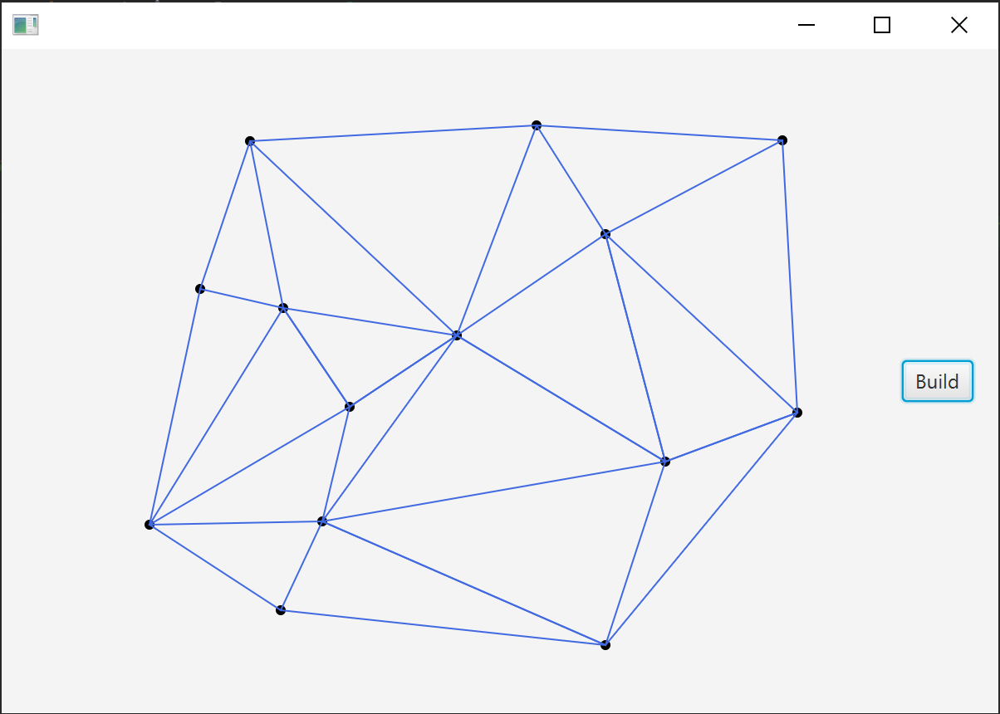

# Лабораторна робота 9 : Діаграма Вороного

**Виконав студент групи ІПС-31**

**Точаненко Владислав Володимирович**

# Опис алгоритму & огляд коду

## Допоміжні класи 

`Edge` - Клас для зберігання ребра.

```kotlin
data class Edge(
    var start: Point,
    var end: Point
) {
    override fun toString(): String {
        return "Edge{" +
                "start=" + start +
                ", end=" + end +
                '}'
    }
}
```

`Rectangle` - клас для зберігання прямокутника.

```kotlin
import javafx.scene.canvas.GraphicsContext
import kotlin.math.abs


class Rectangle(
    private var p1: Point,
    private var p2: Point
) {
    fun draw(context: GraphicsContext) {
        val x1 = p1.x.coerceAtMost(p2.x)
        val y1 = p1.y.coerceAtMost(p2.y)
        val w: Double = abs(p1.x - p2.x)
        val h: Double = abs(p1.y - p2.y)
        context.strokeRect(x1, y1, w, h)
    }
}
```

`Point` - клас для зберігання точки.

```kotlin
import java.util.*
import kotlin.math.abs
import kotlin.math.sqrt

class Point(var x: Double, var y: Double) : Comparable<Point?> {

    fun length(): Double {
        return sqrt(x * x + y * y)
    }

    override fun toString(): String {
        return "{" +
                +x +
                ", " + y +
                '}'
    }

    override fun equals(other: Any?): Boolean {
        if (this === other) return true
        if (other == null || javaClass != other.javaClass) return false
        val point = other as Point
        return equal(point.x, x) &&
                equal(point.y, y)
    }

    override fun hashCode(): Int {
        return Objects.hash(x, y)
    }

    companion object {

        fun area(a: Point, b: Point, c: Point): Double {
            return (b.x - a.x) * (c.y - a.y) - (b.y - a.y) * (c.x - a.x)
        }

        fun equal(a: Double, b: Double): Boolean {
            return abs(a - b) < 1e-4
        }
    }

    override fun compareTo(other: Point?): Int {
        if (other == null)
            return 1
        val comp = x.compareTo(other.x)
        return if (comp != 0) comp else y.compareTo(other.y)
    }
}
```

## Основний алгоритм

### Короткий опис

Необхідно побудувати триангуляцію Делоне для заданої множини точок. Триангуляція Делоне – триангуляція для заданої множини точок на площині, при якій для будь-якого трикутника всі точки, крім вершин, лежать поза колом, описаним навколо трикутника.

Використаємо рандомізований інкрементний алгоритм.

### Словесний опис алгоритму

Алгоритм працює шляхом постійного нарощування поточної триангуляції по одному трикутнику за раз.

Алгоритм на кожній ітерації шукає новий трикутник, який під’єднується до границі поточної триангуляції. Для цього визначимо кожне ребро як

* Спляче ребро – ребро ще не виявлено.
* Живе ребро – ребро виявлено, але лише одна одна примикаюча область визначена.
* Мертве ребро – ребро виявлено, обидві примикаючі області визначені.

На початку поточна триангуляція має лише одне ребро оболонки, яке є живим. Всі інші ребра сплячі. На кожній ітерації вибирається одне з ребер границі і для нього виконується пошук невідомої області.

### Програмна реалізація

#### Допоміжні методи

Функція, що визначає ребро оболонки серед масиву точок. По суті це є перша ітерація методу Джарвіса для побудови опуклої оболонки.

```kotlin
private fun hullEdge(points: ArrayList<Point>, r: Int): Edge? {
    val l = 0
    if (l >= r)
        return null

    var minXPoint: Point = points[l]
    for (i in l until r) {
        val point: Point = points[i]
        if (point.x < minXPoint.x) minXPoint = point
    }

    val firstPoint = Point(minXPoint.x + 0.1, minXPoint.y)
    val secondPoint: Point = minXPoint
    val curVector = Point(secondPoint.x - firstPoint.x, secondPoint.y - firstPoint.y)
    val vectorLength: Double = sqrt(curVector.x * curVector.x + curVector.y * curVector.y)
    var nextPoint: Point? = null
    var maxCos = -2.0

    for (i in l until r) {
        val point: Point = points[i]

        if (point === firstPoint || point === secondPoint)
            continue

        val diffY: Double = secondPoint.y - point.y
        val diffX: Double = secondPoint.x - point.x
        val length: Double = sqrt(diffX * diffX + diffY * diffY)
        val curCos: Double = (-diffX * curVector.x + -diffY * curVector.y) / (vectorLength * length)

        if (curCos > maxCos) {
            nextPoint = point
            maxCos = curCos
        }
    }
    return nextPoint?.let { Edge(minXPoint, it) }
}
```

Для кожного утвореного живого ребра шукаємо спряжену вершину. Ребро переходить у стан мертвого, а примикаючі до точки ребра стають живими.

```kotlin
var steps = 0
while (!liveEdges.isEmpty() && steps < 5000) {
    val edge = liveEdges.first()
    liveEdges.remove(edge)
    val point: Point? = findPoint(points, edge)
    debug = false

    if (point != null) {
        addLiveEdge(liveEdges, point, edge.start)
        addLiveEdge(liveEdges, edge.end, point)
        result.add(Edge(edge.start, point))
        result.add(Edge(edge.end, point))
    }
steps++
```

```kotlin
private fun addLiveEdge(liveEdges: TreeSet<Edge?>, a: Point, b: Point) {
    val edge = Edge(a, b)
    if (liveEdges.contains(edge)) liveEdges.remove(edge) else liveEdges.add(Edge(b, a))
}
```

Шукаємо спряжену точку серед точок справа від ребра. Треба знайти таку точку, щоб коло описане навколо утвореного трикутника мало найменший радіус. 

```kotlin
private fun findPoint(points: ArrayList<Point>, edge: Edge): Point? {
    var curBestPoint: Point? = null
    var curMax = -1.0
    val edgeBisector: NormalLine = NormalLine.bisector(edge)

    for (point in points) {
        if (Point.area(edge.start, edge.end, point) > 0) {
            val edge1 = Edge(edge.end, point)
            val secondBisector: NormalLine = NormalLine.bisector(edge1)
            val intersection: Point = edgeBisector.intersect(secondBisector)
            val vector = Point(intersection.x - edge.start.x, intersection.y - edge.start.y)
            var curRadius: Double = vector.length()

            if (Point.area(edge.start, edge.end, intersection) < 0)
                curRadius = -curRadius
            if (curBestPoint == null || curMax > curRadius) {
                curBestPoint = point
                curMax = curRadius
            }
        }
    }
    return curBestPoint
}
```

#### Основний алгоритм

Програма будує точки динамічно за допомогою технології JavaFX. Раджу запустити і подивитись як воно працює.

### Приклад виконання



## Повний код

### `Main.kt`

```kotlin
import javafx.application.Application
import javafx.fxml.FXMLLoader
import javafx.scene.Parent
import javafx.scene.Scene
import javafx.stage.Stage

class Main : Application() {
    @Throws(Exception::class)
    override fun start(primaryStage: Stage?) {
        val loader = FXMLLoader()
        loader.location = javaClass.getResource("frame.fxml")
        val parent: Parent = loader.load()
        loader.setController(AppController())
        primaryStage!!.scene = Scene(parent)
        primaryStage.show()
    }

    companion object {
        @JvmStatic
        fun main(args: Array<String>) {
            launch(Main::class.java)
        }
    }
}
```

### `AppController.kt`

```kotlin
import javafx.fxml.FXML
import javafx.fxml.Initializable
import javafx.scene.canvas.Canvas
import javafx.scene.canvas.GraphicsContext
import javafx.scene.control.Button
import javafx.scene.input.MouseEvent
import javafx.scene.paint.Color
import javafx.scene.text.Font
import java.net.URL
import java.util.*
import kotlin.math.sqrt


class AppController : Initializable {
    @FXML
    var canvas: Canvas? = null

    @FXML
    var nextButton: Button? = null

    private var context: GraphicsContext? = null
    private val diameter = 6.0
    private var firstRectanglePoint: Point? = null
    private val points: ArrayList<Point> = ArrayList<Point>()
    private var rectangle: Rectangle? = null
    private var rectangleInput = false
    private var rectangleInputEnded = false
    private var debug = false

    override fun initialize(location: URL?, resources: ResourceBundle?) {
        context = canvas?.graphicsContext2D
        context!!.font = Font(null, 10.0)
        onReset()
    }

    private fun hullEdge(points: ArrayList<Point>, r: Int): Edge? {
        val l = 0
        if (l >= r)
            return null

        var minXPoint: Point = points[l]
        for (i in l until r) {
            val point: Point = points[i]
            if (point.x < minXPoint.x) minXPoint = point
        }

        val firstPoint = Point(minXPoint.x + 0.1, minXPoint.y)
        val secondPoint: Point = minXPoint
        val curVector = Point(secondPoint.x - firstPoint.x, secondPoint.y - firstPoint.y)
        val vectorLength: Double = sqrt(curVector.x * curVector.x + curVector.y * curVector.y)
        var nextPoint: Point? = null
        var maxCos = -2.0

        for (i in l until r) {
            val point: Point = points[i]

            if (point === firstPoint || point === secondPoint)
                continue

            val diffY: Double = secondPoint.y - point.y
            val diffX: Double = secondPoint.x - point.x
            val length: Double = sqrt(diffX * diffX + diffY * diffY)
            val curCos: Double = (-diffX * curVector.x + -diffY * curVector.y) / (vectorLength * length)

            if (curCos > maxCos) {
                nextPoint = point
                maxCos = curCos
            }
        }
        return nextPoint?.let { Edge(minXPoint, it) }
    }

    @FXML
    fun onReset() {
        context!!.fill = Color.BLACK
        rectangleInput = false
        canvas?.let { context!!.clearRect(0.0, 0.0, it.width, it.height) }
    }

    private fun deloneTriangulation(points: ArrayList<Point>): ArrayList<Edge?> {
        var startEdge = hullEdge(points, points.size)

        if (startEdge != null && startEdge.start.y < startEdge.end.y) {
            startEdge = Edge(startEdge.end, startEdge.start)
        }

        val result = ArrayList<Edge?>()

        val liveEdges = TreeSet(Comparator { a: Edge, b: Edge ->
            val comp: Int = a.start.compareTo(b.start)
            if (comp != 0) return@Comparator comp
            a.end.compareTo(b.end)
        })

        liveEdges.add(startEdge)
        startEdge?.let { NormalLine.bisector(it) }
        result.add(startEdge)

        var steps = 0
        while (!liveEdges.isEmpty() && steps < 5000) {
            val edge = liveEdges.first()
            liveEdges.remove(edge)
            val point: Point? = findPoint(points, edge)
            debug = false

            if (point != null) {
                addLiveEdge(liveEdges, point, edge.start)
                addLiveEdge(liveEdges, edge.end, point)
                result.add(Edge(edge.start, point))
                result.add(Edge(edge.end, point))
            }

            steps++
        }
        println("steps: $steps")
        return result
    }

    private fun addLiveEdge(liveEdges: TreeSet<Edge?>, a: Point, b: Point) {
        val edge = Edge(a, b)
        if (liveEdges.contains(edge)) liveEdges.remove(edge) else liveEdges.add(Edge(b, a))
    }

    private fun findPoint(points: ArrayList<Point>, edge: Edge): Point? {
        var curBestPoint: Point? = null
        var curMax = -1.0
        val edgeBisector: NormalLine = NormalLine.bisector(edge)

        for (point in points) {
            if (Point.area(edge.start, edge.end, point) > 0) {
                val edge1 = Edge(edge.end, point)
                val secondBisector: NormalLine = NormalLine.bisector(edge1)
                val intersection: Point = edgeBisector.intersect(secondBisector)
                val vector = Point(intersection.x - edge.start.x, intersection.y - edge.start.y)
                var curRadius: Double = vector.length()

                if (Point.area(edge.start, edge.end, intersection) < 0)
                    curRadius = -curRadius
                if (curBestPoint == null || curMax > curRadius) {
                    curBestPoint = point
                    curMax = curRadius
                }
            }
        }
        return curBestPoint
    }

    @FXML
    fun canvasClick(event: MouseEvent) {
        val x: Double = event.x
        val y: Double = event.y
        println("Click: $x $y")
        val point = Point(x, y)

        if (rectangleInput) {
            if (firstRectanglePoint == null) {
                firstRectanglePoint = point
            } else {
                rectangle = Rectangle(firstRectanglePoint!!, point)
                firstRectanglePoint = null
                rectangleInputEnded = true
                redraw()
            }

            return
        }
        points.add(point)
        drawPoint(point)
    }

    private fun redraw() {
        canvas?.let { context!!.clearRect(0.0, 0.0, it.width, it.height) }
        context!!.stroke = Color.BLACK

        for (p in points) {
            drawPoint(p)
        }

        context!!.stroke = Color.ROYALBLUE
        if (rectangle != null) rectangle?.draw(context!!)
    }

    @FXML
    fun nextButtonClick() {
        redraw()
        val edges = deloneTriangulation(points)

        for (edge in edges) {
            if (edge != null) {
                context!!.strokeLine(edge.start.x, edge.start.y, edge.end.x, edge.end.y)
            }
        }

        context!!.stroke = Color.BLACK
    }

    private fun drawPoint(point: Point) {
        val x: Double = point.x
        val y: Double = point.y
        context!!.fillOval(x - diameter / 2, y - diameter / 2, diameter, diameter)
    }
}
```

### `NormalLine.kt`

```kotlin
class NormalLine {
    var a = 0.0
    var b = 0.0
    var c = 0.0

    fun getX(y: Double): Double {
        return if (Point.equal(a, 0.0)) 0.0 else -(c + b * y) / a
    }

    private fun getY(x: Double): Double {
        return if (Point.equal(b, 0.0)) 0.0 else -(a * x + c) / b
    }

    fun intersect(line: NormalLine): Point {
        if (Point.equal(b, 0.0) && Point.equal(line.b, 0.0))
            throw RuntimeException("intersect: both b are 0")
        val x: Double
        val y: Double
        when {
            Point.equal(b, 0.0) -> {
                x = -c / a
                y = line.getY(x)
            }
            Point.equal(line.b, 0.0) -> {
                x = -line.c / line.a
                y = getY(x)
            }
            else -> {
                if (Point.equal(line.b * a - line.a * b, 0.0)) {
                    throw RuntimeException("intersect: Cant find intersect: dividing by 0")
                }
                x = (line.c * b - c * line.b) / (line.b * a - line.a * b)
                y = getY(x)
            }
        }
        return Point(x, y)
    }

    companion object {
        fun bisector(a: Edge): NormalLine {
            val midX = (a.end.x + a.start.x) / 2
            val midY = (a.end.y + a.start.y) / 2
            var verticalLine = false
            if (Point.equal(a.end.x - a.start.x, 0.0))
                verticalLine = true
            val k = (a.end.y - a.start.y) / (a.end.x - a.start.x)
            val line = NormalLine()

            if (Point.equal(k, 0.0)) {
                line.a = 1.0
                line.b = 0.0
                line.c = -midX
            } else {
                val newK: Double = if (verticalLine) 0.0 else -1 / k
                line.a = -newK
                line.b = 1.0
                line.c = -(midY - newK * midX)
            }
            return line
        }
    }
}
```

### `VoronoiEdge.kt`

```kotlin
package voronoi

class VoronoiEdge(
    private val site1: Point,
    private val site2: Point
) {
    var m = 0.0
    var b = 0.0
    private val isVertical: Boolean = site1.y == site2.y
    var p1: Point? = null
    var p2: Point? = null
    fun intersection(that: VoronoiEdge): Point? {
        if (m == that.m && b != that.b && isVertical == that.isVertical)
            return null
        val x: Double
        val y: Double
        when {
            isVertical -> {
                x = (site1.x + site2.x) / 2
                y = that.m * x + that.b
            }
            that.isVertical -> {
                x = (that.site1.x + that.site2.x) / 2
                y = m * x + b
            }
            else -> {
                x = (that.b - b) / (m - that.m)
                y = m * x + b
            }
        }
        return Point(x, y)
    }

    init {
        if (isVertical) {
            b = 0.0
            m = b
        } else {
            m = -1.0 / ((site1.y - site2.y) / (site1.x - site2.x))
            val midpoint = Point.midpoint(site1, site2)
            b = midpoint.y - m * midpoint.x
        }
    }
}
```

### `Rectangle.kt`

```kotlin
import javafx.scene.canvas.GraphicsContext
import kotlin.math.abs


class Rectangle(
    private var p1: Point,
    private var p2: Point
) {
    fun draw(context: GraphicsContext) {
        val x1 = p1.x.coerceAtMost(p2.x)
        val y1 = p1.y.coerceAtMost(p2.y)
        val w: Double = abs(p1.x - p2.x)
        val h: Double = abs(p1.y - p2.y)
        context.strokeRect(x1, y1, w, h)
    }
}
```

### `Edge.kt`

```kotlin
data class Edge(
    var start: Point,
    var end: Point
) {
    override fun toString(): String {
        return "Edge{" +
                "start=" + start +
                ", end=" + end +
                '}'
    }
}
```

### `Point.kt`

```kotlin
import java.util.*
import kotlin.math.abs
import kotlin.math.sqrt

class Point(var x: Double, var y: Double) : Comparable<Point?> {

    fun length(): Double {
        return sqrt(x * x + y * y)
    }

    override fun toString(): String {
        return "{" +
                +x +
                ", " + y +
                '}'
    }

    override fun equals(other: Any?): Boolean {
        if (this === other) return true
        if (other == null || javaClass != other.javaClass) return false
        val point = other as Point
        return equal(point.x, x) &&
                equal(point.y, y)
    }

    override fun hashCode(): Int {
        return Objects.hash(x, y)
    }

    companion object {

        fun area(a: Point, b: Point, c: Point): Double {
            return (b.x - a.x) * (c.y - a.y) - (b.y - a.y) * (c.x - a.x)
        }

        fun equal(a: Double, b: Double): Boolean {
            return abs(a - b) < 1e-4
        }
    }

    override fun compareTo(other: Point?): Int {
        if (other == null)
            return 1
        val comp = x.compareTo(other.x)
        return if (comp != 0) comp else y.compareTo(other.y)
    }
}
```

### `frame.fxml`

```xml
<?xml version="1.0" encoding="UTF-8"?>

<?import javafx.geometry.Insets?>
<?import javafx.scene.canvas.Canvas?>
<?import javafx.scene.control.Button?>
<?import javafx.scene.layout.BorderPane?>
<BorderPane maxHeight="-Infinity" maxWidth="-Infinity" minHeight="-Infinity" minWidth="-Infinity" prefHeight="400.0"
            prefWidth="600.0" xmlns="http://javafx.com/javafx/8.0.172-ea" xmlns:fx="http://javafx.com/fxml/1"
            fx:controller="AppController">
    <top>
    </top>
    <center>
        <Canvas fx:id="canvas" height="343.0" onMouseClicked="#canvasClick" width="602.0"/>
    </center>
    <right>
        <Button fx:id="nextButton" mnemonicParsing="false" onMouseClicked="#nextButtonClick" text="Build"
                BorderPane.alignment="CENTER">
            <BorderPane.margin>
                <Insets right="15.0"/>
            </BorderPane.margin>
        </Button>
    </right>
</BorderPane>
```