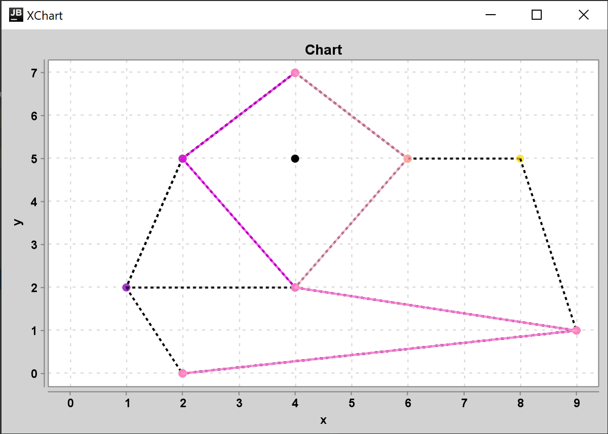

# Лабораторна робота 2 : Локалізація точки на планарному розбитті. Метод ланцюгів

**Виконав студент групи ІПС-31**

**Точаненко Владислав Володимирович**

# Опис алгоритму & огляд коду

## Допоміжні класи

`Dot` - клас для зберігання координат точки та її куту відносно деякої точки, який буде вираховуватись далі.

```kotlin
data class Dot(
    var x: Double,
    var y: Double,
    var angle: Double = 0.0
)
```

`Line` - клас для зберігання відрізків.

```kotlin
data class Line(
    var start: Dot,
    var end: Dot
)
```

`Edge` - клас для зберігання ребер.

```kotlin
class Edge(var from: GraphNode, var to: GraphNode) {
    var weight = 0

    @Override
    override fun equals(other: Any?): Boolean {
        if (other is Edge)
            if (this.from == other.from && this.to == other.to) {
                return true
            }
        return false
    }

    fun swap() {
        val tmp = from
        from = to
        to = tmp
    }
}
```

`GraphNode` - клас для зберігання вершин графу.

```kotlin
class GraphNode(
    var dot: Dot,
    private val edges: MutableList<GraphNode> = mutableListOf()
) {
    var angle = 0.0

    fun addEdge(node: GraphNode) {
        if (edges.find { it == node } == null)
            edges.add(node)
    }

    override fun toString(): String {
        return "(x:${dot.x}, y:${dot.y})"
    }

    fun getEdges() = edges.toList()

    override fun equals(other: Any?): Boolean {
        if (other is GraphNode) {
            if (this.dot.x == other.dot.x && this.dot.y == other.dot.y) {
                return true
            }
        }
        return false
    }
}
```

`Graph` - клас для зберігання графу та виконання деяких операцій над ним.

```kotlin
class Graph(
    val nodes: MutableList<GraphNode>
) {
    fun addEdge(node1: Int, node2: Int) {
        nodes[node1].addEdge(nodes[node2])
    }

    val edges by lazy {
        val edges: MutableList<Edge> = mutableListOf()
        nodes.toList().forEach { i ->
            i.getEdges().forEach { j ->
                edges.add(Edge(i, j))
            }
        }
        edges.distinctBy { it.from to it.to }
    }

    val edgesDistinct by lazy {
        val edges: MutableList<Edge> = mutableListOf()
        nodes.toList().forEach { i ->
            i.getEdges().forEach { j ->
                if (i.dot.y == j.dot.y) {
                    if (i.dot.x < j.dot.x) {
                        edges.add(Edge(i, j))
                    } else {
                        edges.add(Edge(j, i))
                    }
                } else {
                    if (i.dot.y < j.dot.y) {
                        edges.add(Edge(i, j))
                    } else {
                        edges.add(Edge(j, i))
                    }
                }
            }
        }
        edges.distinctBy { it.from to it.to }
    }

    fun contains(node: GraphNode) = nodes.find { it == node } != null
}
```

## Основний алгоритм

### Короткий опис

Метод ланцюгів використовується для локалізації точки на планарному розбитті.


### Словесний опис алгоритму

Спочатку перегортаємо ребра графу так, щоб вони були напрямлені в одну сторону. Потім позначаємо ваги кожного ребра як 1 і нормалізуємо так, щоб ваги ребер, що входять до кожної вершини, і виходять, були однакові. Цей процесс відбувається на регулярному графі, тому нерегулярні графи треба регулізувати. Припустимо, що на вхід алгоритму отримаємо регулярний граф.

### Програмна реалізація

#### Допоміжні методи

Метод `edgesInOut` перегортає усі ребра в одному напрямку.

```kotlin
private fun edgesInOut(edgesIn: Array<MutableList<Int>>, edgesOut: Array<MutableList<Int>>) {
    for (i in graph.edges.indices) {
        if (graph.edges[i].from.dot.y < graph.edges[i].to.dot.y
            || (graph.edges[i].from.dot.y == graph.edges[i].to.dot.y
                    && graph.edges[i].from.dot.x > graph.edges[i].to.dot.x)
        ) {
            edgesIn[getIndex(graph.edges[i].from)].add(i)
            edgesOut[getIndex(graph.edges[i].to)].add(i)
        } else {
            edgesIn[getIndex(graph.edges[i].to)].add(i)
            edgesOut[getIndex(graph.edges[i].from)].add(i)

            graph.edges[i].swap()
        }
        graph.edges[i].weight = 1
    }
}
```

Встановлюємо ваги усіх ребер значенню 1.

Далі ваги ребер обираємо так, щоб виконувались такі умови:

* Кожне ребро має додатню вагу.
* Ваги вхідних та вихідних ребер для кожної вершини графу повинні бути рівні.

Тож за допомогою методу `upIteration` робимо так, що сума ваг ребер, що входять до поточної вершини буле менше або дорівнювала сумі ваг ребер, що виходять з неї. А за допомогою методу `downIteration` робимо так, щоб сума ваг ребер, що входять до вершини була більше, або дорівнювала сумі ваг ребер, що виходять з вершини. Таким чином ці суми будуть рівні.

```kotlin
private fun upIteration(edgesIn: Array<MutableList<Int>>, edgesOut: Array<MutableList<Int>>) {
    for (i in 1 until graph.nodes.size - 1) {
        val weightSumIn = weightSum(edgesIn[i])
        val weightSumOut = edgesOut[i].size

        val leftest = leftestOut(edgesOut[i])
        if (leftest == -1) {
            continue
        }

        if (weightSumIn > weightSumOut) {
            graph.edges[leftest].weight = weightSumIn - weightSumOut + 1
        }
    }
}

private fun downIteration(edgesIn: Array<MutableList<Int>>, edgesOut: Array<MutableList<Int>>) {
    for (i in graph.nodes.size - 2 downTo 1) {
        val weightSumOut = weightSum(edgesOut[i])
        val weightSumIn = weightSum(edgesIn[i])

        val leftest = leftestIn(edgesIn[i])
        if (leftest == -1) {
            continue
        }

        if (weightSumOut > weightSumIn) {
            val weight = graph.edges[leftest].weight
            graph.edges[leftest].weight = weight + weightSumOut - weightSumIn
        }
    }
}
```

Рекурсивно будуємо ланцюги. 

```kotlin
private fun createChain(arrChains: MutableList<MutableList<GraphNode>>, id: Int, shift: Int) {
    arrChains.add(id + shift, mutableListOf())
    for (i in arrChains[id]) {
        if (!arrChains[id + shift].contains(i)) {
            arrChains[id + shift].add(i)
        }
    }
}

private fun createChainsRecursive(
    arrChains: MutableList<MutableList<GraphNode>>,
    edgesOut: Array<MutableList<Int>>,
    node: Int,
    id: Int
): Int {
    var chainId = id
    val list = edgesLeftToRight(edgesOut[node])
    val nodes = graph.nodes
    nodes.sortBy { it.dot.y }

    if (list.isEmpty()) {
        arrChains[chainId].add(nodes[node])
    }

    for (i in list.indices) {
        if (i > 0) {
            chainId++
        }

        arrChains[chainId].add(nodes[node])
        val nextNode =
            if (getIndex(graph.edges[list[i]].from) == node) {
                getIndex(graph.edges[list[i]].to)
            } else {
                getIndex(graph.edges[list[i]].from)
            }

        if (edgesOut[nextNode].size > 1) {
            for (j in 1 until edgesOut[nextNode].size) {
                createChain(arrChains, chainId, j)
            }
        }
        chainId = createChainsRecursive(arrChains, edgesOut, nextNode, chainId)
    }

    return chainId
}
```

Бінарним пошуком шукаємо де знаходиться точка.

```kotlin
private fun searchEdge(point: GraphNode, chain: List<GraphNode>): Edge {
    var l = 0
    var r = chain.size - 1
    var mid: Int

    while (r - l > 1) {
        mid = (l + r) / 2
        if (point.dot.y > chain[mid].dot.y) {
            r = mid
        } else {
            l = mid
        }
    }

    return Edge(chain[l], chain[r])
}
```

Після її знаходження, шукаємо між якими двома ланцюгами знаходиться точка.

```kotlin
private fun searchStripes(point: GraphNode): Pair<List<GraphNode>, List<GraphNode>>? {
    val leftEdge = searchEdge(point, chains[0])
    var side = getSide(leftEdge.from, leftEdge.to, point)
    if (side < 0) {
        println("Point is out of graph on the left.")
        return null
    } else if (side == 0) {
        if (point == leftEdge.from || point == leftEdge.to) {
            println("Point is graph's point.")
            return null
        }
        println("Point is on graph's edge ${leftEdge.from} ${leftEdge.to}.")
        return null
    }

    val rightEdge = searchEdge(point, chains.last())
    side = getSide(rightEdge.from, rightEdge.to, point)
    if (side > 0) {
        println("Point is out of graph on the right.")
        return null
    } else if (side == 0) {
        if (point == rightEdge.from || point == rightEdge.to) {
            println("Point is graph's point.")
            return null
        }
        println("Point is on graph's edge ${leftEdge.from} ${leftEdge.to}.")
        return null
    }

    var l = 0
    var r = chains.size - 1
    var mid: Int
    var edge: Edge

    while (r - l > 1) {
        mid = l + (r - l) / 2
        edge = searchEdge(point, chains[mid])
        side = getSide(edge.from, edge.to, point)
        println("Edge ${leftEdge.from} ${leftEdge.to}.")
        when {
            side < 0 -> {
                r = mid
            }
            side > 0 -> {
                l = mid
            }
            else -> {
                if (point == rightEdge.from || point == rightEdge.to) {
                    println("Point is graph's point.")
                    return null
                }
                println("Point is on graph's edge ${leftEdge.from} ${leftEdge.to}.")
                return null
            }
        }
    }

    return chains[l] to chains[r]
}
```

#### Основний алгоритм

Створюємо списки вершин графу та список суміжних ребер. За ними будуємо граф та визначаємо чи лежить точка у графі, чи за його межами.

```kotlin
val graph = Graph(vertexes)

for (edge in edges) {
    graph.addEdge(edge.first, edge.second)
}

val chains = ChainsMethod(graph, GraphNode(dot))
```

### Побудова графіку

Для побудови графіку була використана бібліотека [xChart](https://github.com/knowm/XChart).

Клас `ChartLine` є допоміжним. Він зберігає список точок як послідовність точок ламаної, а також автоматично надає кожній ламаній унікальну назву, щоб на графіку не було конфліктів.

Клас `Chart` використовується для зберігання ліній та точок, які потім можуть бути відображені на графіку.

* `addLine(List<Dot>)` - як аргумент приймає список точок та додає їх як ламану, що буде намальована на графіку
* `addLine(ChartLine)` - як аргумент приймає об'єкт лінії на графіку та додає як ламану, що буде намальована на графіку
* `addDots(List<Dot>)` - як аргумент приймає список точок та додає їх у список точок, що будуть намальовані на графіку
* `addHighlightedDots(List<Dot>)` - як аргумент приймає список точок та додає їх у список точок, що будуть намальовані на графіку та виділені особливим кольором
* `addHighlightedLine(ChartLine)` - як аргумент приймає лінію, що буде намальована іншим кольором на графіку
* `draw()` - малює графік

### Функція `main`

Спочатку задаємо `vertexes` як список вершин графу. Далі задаємо список суміжних ребер у `edges`. Точку, яку будемо шукати, записуємо у `dot`. Далі знаходимо результат алгоритму і малюємо графік.

```kotlin
fun main() {
    val vertexes = arrayListOf(
        ...
    )

    val edges = arrayListOf(
        ...
    )

    val dot = Dot(4.0, 5.0)

    val graph = Graph(vertexes)

    for (edge in edges) {
        graph.addEdge(edge.first, edge.second)
    }

    val chart = Chart()
    chart.addDots(listOf(dot))

    val chains = ChainsMethod(graph, GraphNode(dot))

    for (chain in chains.chains) {
        chart.addLine(vertexListToDotList(chain))
    }

    if (chains.chainsBetween.first.isNotEmpty() && chains.chainsBetween.second.isNotEmpty()) {
        chart.addHighlightedLine(ChartLine(vertexListToDotList(chains.chainsBetween.first)))
        chart.addHighlightedLine(ChartLine(vertexListToDotList(chains.chainsBetween.second)))
    }

    chart.draw()
}
```
### Приклад виконання

```kotlin
val vertexes = arrayListOf(
    GraphNode(Dot(2.0, 0.0)),
    GraphNode(Dot(9.0, 1.0)),
    GraphNode(Dot(1.0, 2.0)),
    GraphNode(Dot(4.0, 2.0)),
    GraphNode(Dot(2.0, 5.0)),
    GraphNode(Dot(6.0, 5.0)),
    GraphNode(Dot(8.0, 5.0)),
    GraphNode(Dot(4.0, 7.0))
)

val edges = arrayListOf(
    Pair(0, 2),
    Pair(0, 1),
    Pair(2, 4),
    Pair(2, 3),
    Pair(3, 4),
    Pair(4, 7),
    Pair(5, 7),
    Pair(3, 5),
    Pair(6, 5),
    Pair(1, 3),
    Pair(1, 6)
)

val dot = Dot(4.0, 5.0)
```



## Повний код

### `Main.kt`

```kotlin
fun main() {
    val vertexes = arrayListOf(
        GraphNode(Dot(2.0, 0.0)),
        GraphNode(Dot(9.0, 1.0)),
        GraphNode(Dot(1.0, 2.0)),
        GraphNode(Dot(4.0, 2.0)),
        GraphNode(Dot(2.0, 5.0)),
        GraphNode(Dot(6.0, 5.0)),
        GraphNode(Dot(8.0, 5.0)),
        GraphNode(Dot(4.0, 7.0))
    )

    val edges = arrayListOf(
        Pair(0, 2),
        Pair(0, 1),
        Pair(2, 4),
        Pair(2, 3),
        Pair(3, 4),
        Pair(4, 7),
        Pair(5, 7),
        Pair(3, 5),
        Pair(6, 5),
        Pair(1, 3),
        Pair(1, 6)
    )

    val dot = Dot(4.0, 5.0)

    val graph = Graph(vertexes)

    for (edge in edges) {
        graph.addEdge(edge.first, edge.second)
    }

    val chart = Chart()
    chart.addDots(listOf(dot))

    val chains = ChainsMethod(graph, GraphNode(dot))

    for (chain in chains.chains) {
        chart.addLine(vertexListToDotList(chain))
    }

    if (chains.chainsBetween.first.isNotEmpty() && chains.chainsBetween.second.isNotEmpty()) {
        chart.addHighlightedLine(ChartLine(vertexListToDotList(chains.chainsBetween.first)))
        chart.addHighlightedLine(ChartLine(vertexListToDotList(chains.chainsBetween.second)))
    }

    chart.draw()

}

private fun vertexListToDotList(vertexes: List<GraphNode>): List<Dot> {
    val dots = mutableListOf<Dot>()
    for (vertex in vertexes) {
        dots.add(vertex.dot)
    }
    return dots
}
```

### `ChainsMethod.kt`

```kotlin
class ChainsMethod(
    private val graph: Graph,
    private val node: GraphNode
) {
    val chains by lazy {
        val arrChains = mutableListOf<MutableList<GraphNode>>()
        val edgesOut = edgeWeight()

        for (i in edgesOut.last().indices) {
            createChain(arrChains, 0, i)
        }

        createChainsRecursive(arrChains, edgesOut, graph.nodes.size - 1, 0)

        arrChains
    }

    val chainsBetween by lazy {
        var result = emptyList<GraphNode>() to emptyList<GraphNode>()
        if (isTopBottom(node)) {
            result
        } else {
            val searched = searchStripes(node)
            if (searched != null)
                result = searched
            result
        }
    }

    private fun edgeWeight(): Array<MutableList<Int>> {
        val edgesIn = Array<MutableList<Int>>(graph.nodes.size) { mutableListOf() }
        val edgesOut = Array<MutableList<Int>>(graph.nodes.size) { mutableListOf() }

        edgesInOut(edgesIn, edgesOut)

        upIteration(edgesIn, edgesOut)
        downIteration(edgesIn, edgesOut)

        return edgesOut
    }

    private fun edgesInOut(edgesIn: Array<MutableList<Int>>, edgesOut: Array<MutableList<Int>>) {
        for (i in graph.edges.indices) {
            if (graph.edges[i].from.dot.y < graph.edges[i].to.dot.y
                || (graph.edges[i].from.dot.y == graph.edges[i].to.dot.y
                        && graph.edges[i].from.dot.x > graph.edges[i].to.dot.x)
            ) {
                edgesIn[getIndex(graph.edges[i].from)].add(i)
                edgesOut[getIndex(graph.edges[i].to)].add(i)
            } else {
                edgesIn[getIndex(graph.edges[i].to)].add(i)
                edgesOut[getIndex(graph.edges[i].from)].add(i)

                graph.edges[i].swap()
            }
            graph.edges[i].weight = 1
        }
    }

    private fun upIteration(edgesIn: Array<MutableList<Int>>, edgesOut: Array<MutableList<Int>>) {
        for (i in 1 until graph.nodes.size - 1) {
            val weightSumIn = weightSum(edgesIn[i])
            val weightSumOut = edgesOut[i].size

            val leftest = leftestOut(edgesOut[i])
            if (leftest == -1) {
                continue
            }

            if (weightSumIn > weightSumOut) {
                graph.edges[leftest].weight = weightSumIn - weightSumOut + 1
            }
        }
    }

    private fun downIteration(edgesIn: Array<MutableList<Int>>, edgesOut: Array<MutableList<Int>>) {
        for (i in graph.nodes.size - 2 downTo 1) {
            val weightSumOut = weightSum(edgesOut[i])
            val weightSumIn = weightSum(edgesIn[i])

            val leftest = leftestIn(edgesIn[i])
            if (leftest == -1) {
                continue
            }

            if (weightSumOut > weightSumIn) {
                val weight = graph.edges[leftest].weight
                graph.edges[leftest].weight = weight + weightSumOut - weightSumIn
            }
        }
    }

    private fun weightSum(weight: List<Int>): Int {
        var sum = 0
        for (i in weight) {
            sum += graph.edges[i].weight
        }
        return sum
    }

    private fun leftestOut(list: List<Int>): Int {
        var leftest = -1

        for (i in list) {
            if (leftest == -1 || graph.edges[i].to.dot.x < graph.edges[leftest].to.dot.x) {
                leftest = i
            }
        }

        return leftest
    }

    private fun leftestIn(list: List<Int>): Int {
        var leftest = -1
        for (i in list) {
            if (leftest == -1 || graph.edges[i].from.dot.x < graph.edges[leftest].from.dot.x) {
                leftest = i
            }
        }

        return leftest
    }

    private fun createChain(arrChains: MutableList<MutableList<GraphNode>>, id: Int, shift: Int) {
        arrChains.add(id + shift, mutableListOf())
        for (i in arrChains[id]) {
            if (!arrChains[id + shift].contains(i)) {
                arrChains[id + shift].add(i)
            }
        }
    }

    private fun createChainsRecursive(
        arrChains: MutableList<MutableList<GraphNode>>,
        edgesOut: Array<MutableList<Int>>,
        node: Int,
        id: Int
    ): Int {
        var chainId = id
        val list = edgesLeftToRight(edgesOut[node])
        val nodes = graph.nodes
        nodes.sortBy { it.dot.y }

        if (list.isEmpty()) {
            arrChains[chainId].add(nodes[node])
        }

        for (i in list.indices) {
            if (i > 0) {
                chainId++
            }

            arrChains[chainId].add(nodes[node])
            val nextNode =
                if (getIndex(graph.edges[list[i]].from) == node) {
                    getIndex(graph.edges[list[i]].to)
                } else {
                    getIndex(graph.edges[list[i]].from)
                }

            if (edgesOut[nextNode].size > 1) {
                for (j in 1 until edgesOut[nextNode].size) {
                    createChain(arrChains, chainId, j)
                }
            }
            chainId = createChainsRecursive(arrChains, edgesOut, nextNode, chainId)
        }

        return chainId
    }

    private fun edgesLeftToRight(edgesId: MutableList<Int>): MutableList<Int> {
        for (i in edgesId) {
            for (j in i + 1 until edgesId.size) {
                if (getSide(
                        graph.edges[edgesId[i]].from,
                        graph.edges[edgesId[i]].to,
                        graph.edges[edgesId[j]].to
                    ) < 0
                ) {
                    val tmp = edgesId[j]
                    edgesId[j] = edgesId[i]
                    edgesId[i] = tmp
                }
            }
        }

        return edgesId
    }

    private fun getIndex(node: GraphNode): Int {
        val nodes = graph.nodes
        nodes.sortBy { it.dot.y }
        for (i in nodes.indices) {
            if (nodes[i] == node) {
                return i
            }
        }
        return -1
    }

    private fun isTopBottom(node: GraphNode): Boolean {
        val nodes = graph.nodes
        nodes.sortBy { it.dot.y }
        if (node.dot.y > nodes.last().dot.y) {
            println("Point is out of graph on the top.")
            return true
        }
        if (node.dot.y < nodes[0].dot.y) {
            println("Point is out of graph on the bottom.")
            return true
        }
        return false
    }

    private fun searchStripes(point: GraphNode): Pair<List<GraphNode>, List<GraphNode>>? {
        val leftEdge = searchEdge(point, chains[0])
        var side = getSide(leftEdge.from, leftEdge.to, point)
        if (side < 0) {
            println("Point is out of graph on the left.")
            return null
        } else if (side == 0) {
            if (point == leftEdge.from || point == leftEdge.to) {
                println("Point is graph's point.")
                return null
            }
            println("Point is on graph's edge ${leftEdge.from} ${leftEdge.to}.")
            return null
        }

        val rightEdge = searchEdge(point, chains.last())
        side = getSide(rightEdge.from, rightEdge.to, point)
        if (side > 0) {
            println("Point is out of graph on the right.")
            return null
        } else if (side == 0) {
            if (point == rightEdge.from || point == rightEdge.to) {
                println("Point is graph's point.")
                return null
            }
            println("Point is on graph's edge ${leftEdge.from} ${leftEdge.to}.")
            return null
        }

        var l = 0
        var r = chains.size - 1
        var mid: Int
        var edge: Edge

        while (r - l > 1) {
            mid = l + (r - l) / 2
            edge = searchEdge(point, chains[mid])
            side = getSide(edge.from, edge.to, point)
            println("Edge ${leftEdge.from} ${leftEdge.to}.")
            when {
                side < 0 -> {
                    r = mid
                }
                side > 0 -> {
                    l = mid
                }
                else -> {
                    if (point == rightEdge.from || point == rightEdge.to) {
                        println("Point is graph's point.")
                        return null
                    }
                    println("Point is on graph's edge ${leftEdge.from} ${leftEdge.to}.")
                    return null
                }
            }
        }

        return chains[l] to chains[r]
    }

    private fun searchEdge(point: GraphNode, chain: List<GraphNode>): Edge {
        var l = 0
        var r = chain.size - 1
        var mid: Int

        while (r - l > 1) {
            mid = (l + r) / 2
            if (point.dot.y > chain[mid].dot.y) {
                r = mid
            } else {
                l = mid
            }
        }

        return Edge(chain[l], chain[r])
    }


    private fun getSide(a: GraphNode, b: GraphNode, c: GraphNode): Int {
        val distance = getRotation(a, b, c)

        if (distance > 0)
            return 1
        if (distance < 0)
            return -1
        return 0
    }


    private fun getRotation(a: GraphNode, b: GraphNode, c: GraphNode) =
        (c.dot.y - a.dot.y) * (b.dot.x - a.dot.x) - (b.dot.y - a.dot.y) * (c.dot.x - a.dot.x)
}
```

### `Graph.kt`

```kotlin
class Graph(
    val nodes: MutableList<GraphNode>
) {
    fun addEdge(node1: Int, node2: Int) {
        nodes[node1].addEdge(nodes[node2])
    }

    val edges by lazy {
        val edges: MutableList<Edge> = mutableListOf()
        nodes.toList().forEach { i ->
            i.getEdges().forEach { j ->
                edges.add(Edge(i, j))
            }
        }
        edges.distinctBy { it.from to it.to }
    }

    val edgesDistinct by lazy {
        val edges: MutableList<Edge> = mutableListOf()
        nodes.toList().forEach { i ->
            i.getEdges().forEach { j ->
                if (i.dot.y == j.dot.y) {
                    if (i.dot.x < j.dot.x) {
                        edges.add(Edge(i, j))
                    } else {
                        edges.add(Edge(j, i))
                    }
                } else {
                    if (i.dot.y < j.dot.y) {
                        edges.add(Edge(i, j))
                    } else {
                        edges.add(Edge(j, i))
                    }
                }
            }
        }
        edges.distinctBy { it.from to it.to }
    }

    fun contains(node: GraphNode) = nodes.find { it == node } != null
}
```

### `GraphNode.kt`

```kotlin
class GraphNode(
    var dot: Dot,
    private val edges: MutableList<GraphNode> = mutableListOf()
) {
    var angle = 0.0

    fun addEdge(node: GraphNode) {
        if (edges.find { it == node } == null)
            edges.add(node)
    }

    override fun toString(): String {
        return "(x:${dot.x}, y:${dot.y})"
    }

    fun getEdges() = edges.toList()

    override fun equals(other: Any?): Boolean {
        if (other is GraphNode) {
            if (this.dot.x == other.dot.x && this.dot.y == other.dot.y) {
                return true
            }
        }
        return false
    }
}
```

### `Edge.kt`

```kotlin
class Edge(var from: GraphNode, var to: GraphNode) {
    var weight = 0

    @Override
    override fun equals(other: Any?): Boolean {
        if (other is Edge)
            if (this.from == other.from && this.to == other.to) {
                return true
            }
        return false
    }

    fun swap() {
        val tmp = from
        from = to
        to = tmp
    }
}
```

### `Line.kt`

```kotlin
data class Line(
    var start: Dot,
    var end: Dot
)
```

### `Dot.kt`

```kotlin
data class Dot(
    var x: Double,
    var y: Double,
    var angle: Double = 0.0
)
```

### `Chart.kt`

```kotlin
import org.knowm.xchart.QuickChart
import org.knowm.xchart.SwingWrapper
import org.knowm.xchart.XYChart
import org.knowm.xchart.style.lines.SeriesLines
import org.knowm.xchart.style.markers.SeriesMarkers
import java.awt.Color

class Chart(
    private val chartName: String = "Chart",
    private val xName: String = "x",
    private val yName: String = "y"
) {

    private val chart: XYChart =
        QuickChart.getChart(
            chartName, xName, yName, "0, 0",
            doubleArrayOf(0.0), doubleArrayOf(0.0)
        )

    private var lines = mutableListOf<ChartLine>()
    private var highlightedLines = mutableListOf<ChartLine>()
    private var dots = mutableListOf<Dot>()
    private var highlightedDots = mutableListOf<Dot>()

    fun addLine(dots: List<Dot>) {
        lines.add(ChartLine(dots))
    }

    fun addDots(dots: List<Dot>) {
        for (i in dots.indices) {
            this.dots.add(dots[i])
        }
    }

    fun addHighlightedDots(dots: List<Dot>) {
        for (i in dots.indices) {
            this.highlightedDots.add(dots[i])
        }
    }

    fun addHighlightedLine(line: ChartLine) {
        highlightedLines.add(line)
    }

    fun addLine(line: ChartLine) {
        lines.add(line)
    }

    fun draw() {
        for (line in lines)
            chart.addSeries(line.lineName, line.xData, line.yData)
                .setMarker(SeriesMarkers.CIRCLE).setLineColor(Color.BLACK).setLineStyle(SeriesLines.DASH_DASH)

        for (line in highlightedLines)
            chart.addSeries(line.lineName, line.xData, line.yData)
                .setMarker(SeriesMarkers.CIRCLE).setLineStyle(SeriesLines.SOLID)

        for (i in dots.indices)
            chart.addSeries("dot#$i", doubleArrayOf(dots[i].x), doubleArrayOf(dots[i].y))
                .setMarkerColor(Color.BLACK).setMarker(SeriesMarkers.CIRCLE)

        for (i in highlightedDots.indices)
            chart.addSeries("dot#${i + dots.size}", doubleArrayOf(highlightedDots[i].x), doubleArrayOf(highlightedDots[i].y))
                .setMarkerColor(Color.RED).setMarker(SeriesMarkers.CIRCLE)

        SwingWrapper(chart).displayChart()
    }
}
```

### `ChartLine.kt`

```kotlin
class ChartLine(
    var xData: DoubleArray,
    var yData: DoubleArray,
    var lineName: String = "#"
) {
    constructor(dots: List<Dot>) : this(DoubleArray(dots.size), DoubleArray(dots.size)) {
        for (i: Int in dots.indices) {
            xData[i] = dots[i].x
            yData[i] = dots[i].y
        }
    }

    init {
        if (lineName == "#") {
            lineName += id++
        }
    }
}

private var id = 1
```