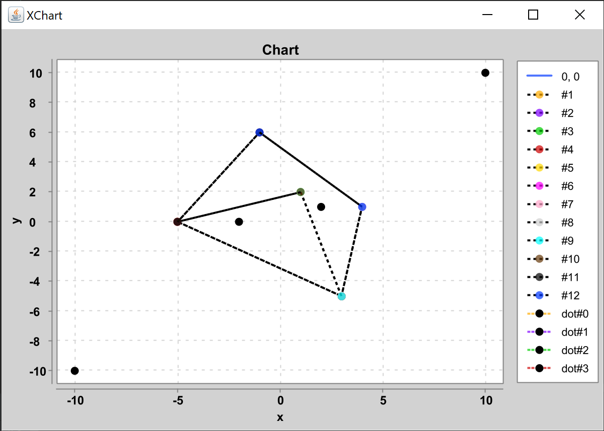
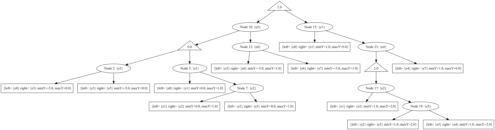

# Лабораторна робота 3 : Локалізація точки на планарному розбитті. Метод трапецій

**Виконав студент групи ІПС-31**

**Точаненко Владислав Володимирович**

# Опис алгоритму & огляд коду

## Допоміжні класи 

`Dot` - клас для зберігання координат точки та її куту відносно деякої точки, який буде вираховуватись далі.

```kotlin
data class Dot(
    var x: Double,
    var y: Double,
    var angle: Double = 0.0
)
```

`Line` - клас для зберігання відрізків.

```kotlin
data class Line(
    var start: Dot,
    var end: Dot
)
```

`Edge` - клас для зберігання ребер графу.

```kotlin
class Edge {
    private val a: Vertex
    private val b: Vertex
    private val middle: Point
    private var name: String? = null

    ...
}
```

`Node` - клас для зберігання вершин графу.

```kotlin
class Node {
    var left: Node? = null

    var right: Node? = null

    private var trapezium: Trapezium? = null

    var edge: Edge? = null

    var median: Double? = null
        private set

    var weight = 0
        private set
    private var id: Int

    ...
}
```


`Trapezium` - клас для зберігання трапецій.

```kotlin
class Trapezium {
    var left: Edge? = null
    var right: Edge? = null
    var minY = 0.0
    var maxY = 0.0

    ...
}
```

## Основний алгоритм

### Короткий опис

Метод трапецій використовує бінарне дерево пошуку для локалізації точки на планарному розбитті.

### Словесний опис алгоритму

Механізм побудови структури даних пошуку обробляє по одній трапеції та намагається розбити її на максимально можливу кількість менших трапецій. Це відбувається шляхом розрізання трапеції `R` на нижню `R1` та верхню `R2` горизонтальною прямою, яка є медіаною множини ординат вершин всередині `R`.

Якщо ребро графа `G` перетинає обидві горизонтальні сторони трапеції, то воно називається закриваючим.

Після визначення медіани `Ymed` трапеції `R` множина ребер графа `G`, яка перетинає `R`, проглядається зліва направо та розділяється на дві множини, що відносяться до `R1` та `R2` . Якщо зустрічається закриваюче ребро, воно стає правою боковою границею нової трапеції, яка обробляється незалежно.

Пошук здійснюється шляхом локалізації пробної точки в послідовності вкладених трапецій, поки не отримаємо трапецію, усередині якої немає ребер графа чи їх фрагментів.

### Програмна реалізація

#### Допоміжні методи

Метод `writeFile` записує дерево у файл для подальшого використання алгоритмом.

```kotlin
fun writeFile(fileName: String, graph: Graph) {
    val file = File("src/main/resources/$fileName.dot")
    val newFile = file.createNewFile()
    try {
        FileWriter(file).use { writer ->
            writer.write("digraph G {\n")
            writer.flush()
        }
    } catch (ex: IOException) {
        println(ex.message)
    }
    printNodeShapeToFile(graph.root(), file)
    printTreeToFile(graph.root(), file)
    try {
        FileWriter(file, true).use { writer ->
            writer.write("}")
            writer.flush()
        }
    } catch (ex: IOException) {
        println(ex.message)
    }
}
```

Метод `createPNG` створює картинку дерева за допомогою бібліотеки [Graphviz Java](https://github.com/nidi3/graphviz-java).

```kotlin
fun createPNG(fileName: String) {
    val file = File("src/main/resources/$fileName.dot")
    val mutableGraph = Parser().read(file)
    Graphviz.fromGraph(mutableGraph)
        .height(700)
        .render(Format.PNG)
        .toFile(File("src/main/resources/$fileName.png"))
}
```

Будуємо дерево трапецій.

```kotlin
fun buildTrapezium(v: List<Vertex>, e: MutableList<Edge>, T: Trapezium?): Node {
    if (v.size == 0)
        return Node(T, 0)
        
    val Edg: MutableList<MutableList<Edge>> =
        ArrayList<MutableList<Edge>>() //edges of trapezium
    val Vert: MutableList<MutableList<Vertex>> =
        ArrayList<MutableList<Vertex>>() //vertexes of trapezium sorted by y-coordinate
    val U: MutableList<MutableList<Node>> =
        ArrayList<MutableList<Node>>() //list of trapeziums
    val Tr: Array<Trapezium?> = arrayOfNulls<Trapezium>(2)
    var weight = 0
    for (i in 0..1) {
        Edg.add(ArrayList<Edge>())
        Vert.add(ArrayList<Vertex>())
        U.add(ArrayList<Node>())
        Tr[i] = Trapezium()
    }

    val yMed: Double = v[(v.size - 1) / 2]!!.y
    Tr[0]!!.minY = T!!.minY
    Tr[0]!!.maxY = yMed
    Tr[1]!!.minY = yMed
    Tr[1]!!.maxY = T!!.maxY

    e.sortWith(Comparator.comparingDouble<Edge>(ToDoubleFunction<Edge> { obj: Edge ->
        obj.middleXInInterval(
            Tr[0]!!.minY,
            Tr[0]!!.maxY
        )
    }))

    for (e in e) {
        for (i in 0..0) {
            val `in`: Int = Tr[i]!!.edgeBelongs(e)
            //e has end in Tr[i]
            if (`in` == 1) {
                Edg[i].add(e)
                if (Tr[i]!!.vertexBelongs(e.getA())) {
                    Vert[i].add(e.getA())
                    weight++
                }
                if (Tr[i]!!.vertexBelongs(e.getB())) {
                    Vert[i].add(e.getB())
                    weight++
                }
                //remove duplicates
                val set: Set<Vertex> = LinkedHashSet<Vertex>(Vert[i])
                Vert[i].clear()
                Vert[i].addAll(set)
                Vert[i].sortWith(Comparator.comparingDouble<Vertex>({ it.y }))
            } else if (`in` == 0 || e === Tr[i]!!.right) {
                Edg[i].add(e)
                if (Tr[i]!!.left == null) {
                    Tr[i]!!.left = e
                } else {
                    Tr[i]!!.right = e
                    val n: Node = buildTrapezium(Vert[i], Edg[i], Tr[i])
                    U[i].add(n)
                    if (e !== T!!.right) {
                        U[i].add(Node(e))
                    }
                    Edg[i].clear()
                    Vert[i].clear()
                    Edg[i].add(e)
                    Tr[i] = Trapezium()
                    Tr[0]!!.minY = T!!.minY
                    Tr[0]!!.maxY = yMed
                    Tr[1]!!.minY = yMed
                    Tr[1]!!.maxY = T!!.maxY
                    Tr[i]!!.left = e
                    Tr[i]!!.right = null
                }
            }
        }
    }

    e.sortWith(Comparator.comparingDouble<Edge>(ToDoubleFunction<Edge> { obj: Edge ->
        obj.middleXInInterval(
            Tr[1]!!.minY,
            Tr[1]!!.maxY
        )
    }))

    for (e in e) {
        for (i in 1..1) {
            val `in`: Int = Tr[i]!!.edgeBelongs(e)
            //e has end in Tr[i]
            if (`in` == 1) {
                Edg[i].add(e)
                if (Tr[i]!!.vertexBelongs(e.getA())) {
                    Vert[i].add(e.getA())
                    weight++
                }
                if (Tr[i]!!.vertexBelongs(e.getB())) {
                    Vert[i].add(e.getB())
                    weight++
                }
                //remove duplicates
                val set: Set<Vertex> = LinkedHashSet<Vertex>(Vert[i])
                Vert[i].clear()
                Vert[i].addAll(set)
                Vert[i].sortWith(Comparator.comparingDouble<Vertex>({ it.y }))
            } else if (`in` == 0 || e === Tr[i]!!.right) {
                Edg[i].add(e)
                if (Tr[i]!!.left == null) {
                    Tr[i]!!.left = e
                } else {
                    Tr[i]!!.right = e
                    val n: Node = buildTrapezium(Vert[i], Edg[i], Tr[i])
                    U[i].add(n)
                    if (e !== T!!.right) {
                        U[i].add(Node(e))
                    }
                    Edg[i].clear()
                    Vert[i].clear()
                    Edg[i].add(e)
                    Tr[i] = Trapezium()
                    Tr[0]!!.minY = T!!.minY
                    Tr[0]!!.maxY = yMed
                    Tr[1]!!.minY = yMed
                    Tr[1]!!.maxY = T!!.maxY
                    Tr[i]!!.left = e
                    Tr[i]!!.right = null
                }
            }
        }
    }
        
    val root = Node(yMed, weight + 1)
    root.left = balance(U[0])
    root.right = balance(U[1])
    return root
}
```

Балансуємо дерево.

```kotlin
fun balance(U: List<Node>): Node? {
    val edgs: MutableList<Node> = ArrayList<Node>()
    val leaves: MutableList<Node> = ArrayList<Node>()
    for (i in U.indices) {
        if (i % 2 == 0) {
            leaves.add(U[i])
        } else {
            edgs.add(U[i])
        }
    }

    val root: Node? = balancedGEdgeTree(edgs, 0, edgs.size - 1)
    balancedTree(root, leaves)
    return root
}

private fun balancedGEdgeTree(edgs: List<Node>, i: Int, j: Int): Node? {
    if (i == j) {
        return edgs[i]
    }
    if (i > j) {
        return null
    }
    val k = (i + j) / 2
    val n: Node = edgs[k]
    n.left = balancedGEdgeTree(edgs, i, k - 1)
    n.right = balancedGEdgeTree(edgs, k + 1, j)
    return n
}

private fun balancedTree(root: Node?, leaves: MutableList<Node>) {
    if (root == null) {
        return
    }
    if (root.left != null && root.right != null) {
        balancedTree(root.left, leaves)
    }
    if (root.left == null) {
        root.left = leaves.removeAt(0)
    }
    if (root.right == null) {
        root.right = leaves.removeAt(0)
        return
    }
    balancedTree(root.right, leaves)
}
```

Знаходимо чи належить точка графу.

```kotlin
fun localization(root: Node?, point: Point) {
    if (root!!.left == null && root.right == null) {
        val t: Trapezium? = root.getTrapezium()
        if (java.lang.Double.compare(t!!.minY, point.y) > 0) {
            println("Point is out of the graph;")
        } else if (java.lang.Double.compare(t.maxY, point.y) < 0) {
            println("Point is out of the graph;")
        } else if (t.left!!.getSide(point) == -1 || t.right!!.getSide(point) == 1) {
            println("Point is out of the graph;")
        } else {
            System.out.println(t)
        }
        return
    } else if (root.edge != null) {
        val edge: Edge? = root.edge
        if (edge!!.getSide(point) == 0) {
            println("point is on the edge $edge")
            return
        } else if (edge.getSide(point) == -1) {
            localization(root.left, point)
        } else {
            localization(root.right, point)
        }
    } else {
        val vertex: Double = root.median!!
        if (java.lang.Double.compare(vertex, point.y) > 0) {
            localization(root.left, point)
        } else {
            localization(root.right, point)
        }
    }
}
```

#### Основний алгоритм

Створюємо списки вершин графу та матрицю суміжності. Будуємо на їх основі граф. Малюємо отримане дерево, малюємо граф та визначаємо чи належать деякі точки до нього.

```kotlin
val points: Array<Point?> = arrayOf(
    ...
)

val matrix = arrayOf(
    ...
)

val graph = Graph(points, matrix)
graphviz.writeFile("graphviz", graph)
graphviz.createPNG("graphviz")

val dots = arrayListOf(
    ...
)

for (dot in dots) {
    graph.localization(Point(dot.x, dot.y))
}
```

### Побудова графіку

Для побудови графіку була використана бібліотека [xChart](https://github.com/knowm/XChart).

Клас `ChartLine` є допоміжним. Він зберігає список точок як послідовність точок ламаної, а також автоматично надає кожній ламаній унікальну назву, щоб на графіку не було конфліктів.

Клас `Chart` використовується для зберігання ліній та точок, які потім можуть бути відображені на графіку.

* `addLine(List<Dot>)` - як аргумент приймає список точок та додає їх як ламану, що буде намальована на графіку
* `addLine(ChartLine)` - як аргумент приймає об'єкт лінії на графіку та додає як ламану, що буде намальована на графіку
* `addDots(List<Dot>)` - як аргумент приймає список точок та додає їх у список точок, що будуть намальовані на графіку
* `addHighlightedDots(List<Dot>)` - як аргумент приймає список точок та додає їх у список точок, що будуть намальовані на графіку та виділені особливим кольором
* `addHighlightedLine(ChartLine)` - як аргумент приймає лінію, що буде намальована іншим кольором на графіку
* `draw()` - малює графік

### Приклад виконання

```kotlin
val points: Array<Point?> = arrayOf(
    Point(3.0, -5.0),
    Point(-5.0, 0.0),
    Point(4.0, 1.0),
    Point(1.0, 2.0),
    Point(-1.0, 6.0)
)

val matrix = arrayOf(
    booleanArrayOf(false, true, true, true, false),
    booleanArrayOf(true, false, false, true, true),
    booleanArrayOf(true, false, false, false, true),
    booleanArrayOf(true, true, false, false, false),
    booleanArrayOf(false, true, true, false, false)
)

val dots = arrayListOf(
    Dot(10.0, 10.0),
    Dot(-2.0, 0.0),
    Dot(-10.0, -10.0),
    Dot(2.0, 1.0)
)
```





```
Point is out of the graph;
{left= {e2} right= {e5} minY=0.0, maxY=1.0}
Point is out of the graph;
{left= {e5} right= {e4} minY=1.0, maxY=2.0}
```

## Повний код

### `Main.kt`

```kotlin
import chart.Chart
import chart.ChartLine
import chart.Dot
import graph.Graph
import graph.Point

fun main() {

    val points: Array<Point?> = arrayOf(
        Point(3.0, -5.0),
        Point(-5.0, 0.0),
        Point(4.0, 1.0),
        Point(1.0, 2.0),
        Point(-1.0, 6.0)
    )

    val matrix = arrayOf(
        booleanArrayOf(false, true, true, true, false),
        booleanArrayOf(true, false, false, true, true),
        booleanArrayOf(true, false, false, false, true),
        booleanArrayOf(true, true, false, false, false),
        booleanArrayOf(false, true, true, false, false)
    )

    val graph = Graph(points, matrix)
    graphviz.writeFile("graphviz", graph)
    graphviz.createPNG("graphviz")

    val lines = mutableListOf<ChartLine>()

    for (i in matrix[0].indices)
        for (j in matrix[0].indices)
            if (matrix[i][j])
                lines.add(
                    ChartLine(
                        listOf(
                            Dot(points[i]!!.x, points[i]!!.y),
                            Dot(points[j]!!.x, points[j]!!.y)
                        )
                    )
                )


    val dots = arrayListOf(
        Dot(10.0, 10.0),
        Dot(-2.0, 0.0),
        Dot(-10.0, -10.0),
        Dot(2.0, 1.0)
    )

    for (dot in dots) {
        graph.localization(Point(dot.x, dot.y))
    }

    val chart = Chart()
    for (line in lines)
        chart.addLine(line)

    chart.addDots(dots)

    chart.draw()
}
```

### `GraphvizUtils.kt`

```kotlin
package graphviz

import graph.Graph
import graph.Node
import guru.nidi.graphviz.engine.Format
import guru.nidi.graphviz.engine.Graphviz
import guru.nidi.graphviz.parse.Parser
import java.io.File
import java.io.FileWriter
import java.io.IOException

fun createPNG(fileName: String) {
    val file = File("src/main/resources/$fileName.dot")
    val mutableGraph = Parser().read(file)
    Graphviz.fromGraph(mutableGraph)
        .height(700)
        .render(Format.PNG)
        .toFile(File("src/main/resources/$fileName.png"))
}

fun writeFile(fileName: String, graph: Graph) {
    val file = File("src/main/resources/$fileName.dot")
    val newFile = file.createNewFile()
    try {
        FileWriter(file).use { writer ->
            writer.write("digraph G {\n")
            writer.flush()
        }
    } catch (ex: IOException) {
        println(ex.message)
    }
    printNodeShapeToFile(graph.root(), file)
    printTreeToFile(graph.root(), file)
    try {
        FileWriter(file, true).use { writer ->
            writer.write("}")
            writer.flush()
        }
    } catch (ex: IOException) {
        println(ex.message)
    }
}

private fun printNodeShapeToFile(root: Node?, file: File?) {
    if (root != null) {
        printNodeShapeToFile(root.left, file)
        try {
            FileWriter(file, true).use { writer ->
                writer.write(root.shape())
                writer.flush()
            }
        } catch (ex: IOException) {
            println(ex.message)
        }
        printNodeShapeToFile(root.right, file)
    }
}

private fun printTreeToFile(root: Node?, file: File?) {
    if (root != null) {
        printTreeToFile(root.left, file)
        if (root.left != null) {
            try {
                FileWriter(file, true).use { writer ->
                    writer.write(
                        """
                            "$root"->"${root.left}";
                            
                            """.trimIndent()
                    )
                    writer.flush()
                }
            } catch (ex: IOException) {
                println(ex.message)
            }
        }
        if (root.right != null) {
            try {
                FileWriter(file, true).use { writer ->
                    writer.write(
                        """
                            "$root"->"${root.right}";
                            
                            """.trimIndent()
                    )
                    writer.flush()
                }
            } catch (ex: IOException) {
                println(ex.message)
            }
        }
        printTreeToFile(root.right, file)
    }
}
```

### `Graph.kt`

```kotlin
package graph


import java.io.File
import java.io.FileWriter
import java.io.IOException
import java.util.*
import java.util.function.ToDoubleFunction
import kotlin.collections.LinkedHashSet

class Graph(points: Array<Point?>, matrix: Array<BooleanArray>) {
    private val vertices //sorted by y coordinate
            : MutableList<Vertex>
    private val edges: MutableList<Edge>
    private val N: Int
    private val trapezium: Trapezium
    var myRoot: Node

    fun buildTrapezium(v: List<Vertex>, e: MutableList<Edge>, T: Trapezium?): Node {
        if (v.size == 0)
            return Node(T, 0)
        
        val Edg: MutableList<MutableList<Edge>> =
            ArrayList<MutableList<Edge>>() //edges of trapezium
        val Vert: MutableList<MutableList<Vertex>> =
            ArrayList<MutableList<Vertex>>() //vertexes of trapezium sorted by y-coordinate
        val U: MutableList<MutableList<Node>> =
            ArrayList<MutableList<Node>>() //list of trapeziums
        val Tr: Array<Trapezium?> = arrayOfNulls<Trapezium>(2)
        var weight = 0
        for (i in 0..1) {
            Edg.add(ArrayList<Edge>())
            Vert.add(ArrayList<Vertex>())
            U.add(ArrayList<Node>())
            Tr[i] = Trapezium()
        }

        val yMed: Double = v[(v.size - 1) / 2]!!.y
        Tr[0]!!.minY = T!!.minY
        Tr[0]!!.maxY = yMed
        Tr[1]!!.minY = yMed
        Tr[1]!!.maxY = T!!.maxY
        e.sortWith(Comparator.comparingDouble<Edge>(ToDoubleFunction<Edge> { obj: Edge ->
            obj.middleXInInterval(
                Tr[0]!!.minY,
                Tr[0]!!.maxY
            )
        }))
        for (e in e) {
            for (i in 0..0) {
                val `in`: Int = Tr[i]!!.edgeBelongs(e)
                //e has end in Tr[i]
                if (`in` == 1) {
                    Edg[i].add(e)
                    if (Tr[i]!!.vertexBelongs(e.getA())) {
                        Vert[i].add(e.getA())
                        weight++
                    }
                    if (Tr[i]!!.vertexBelongs(e.getB())) {
                        Vert[i].add(e.getB())
                        weight++
                    }
                    //remove duplicates
                    val set: Set<Vertex> = LinkedHashSet<Vertex>(Vert[i])
                    Vert[i].clear()
                    Vert[i].addAll(set)
                    Vert[i].sortWith(Comparator.comparingDouble<Vertex>({ it.y }))
                } else if (`in` == 0 || e === Tr[i]!!.right) {
                    Edg[i].add(e)
                    if (Tr[i]!!.left == null) {
                        Tr[i]!!.left = e
                    } else {
                        Tr[i]!!.right = e
                        val n: Node = buildTrapezium(Vert[i], Edg[i], Tr[i])
                        U[i].add(n)
                        if (e !== T!!.right) {
                            U[i].add(Node(e))
                        }
                        Edg[i].clear()
                        Vert[i].clear()
                        Edg[i].add(e)
                        Tr[i] = Trapezium()
                        Tr[0]!!.minY = T!!.minY
                        Tr[0]!!.maxY = yMed
                        Tr[1]!!.minY = yMed
                        Tr[1]!!.maxY = T!!.maxY
                        Tr[i]!!.left = e
                        Tr[i]!!.right = null
                    }
                }
            }
        }

        e.sortWith(Comparator.comparingDouble<Edge>(ToDoubleFunction<Edge> { obj: Edge ->
            obj.middleXInInterval(
                Tr[1]!!.minY,
                Tr[1]!!.maxY
            )
        }))

        for (e in e) {
            for (i in 1..1) {
                val `in`: Int = Tr[i]!!.edgeBelongs(e)
                //e has end in Tr[i]
                if (`in` == 1) {
                    Edg[i].add(e)
                    if (Tr[i]!!.vertexBelongs(e.getA())) {
                        Vert[i].add(e.getA())
                        weight++
                    }
                    if (Tr[i]!!.vertexBelongs(e.getB())) {
                        Vert[i].add(e.getB())
                        weight++
                    }
                    //remove duplicates
                    val set: Set<Vertex> = LinkedHashSet<Vertex>(Vert[i])
                    Vert[i].clear()
                    Vert[i].addAll(set)
                    Vert[i].sortWith(Comparator.comparingDouble<Vertex>({ it.y }))
                } else if (`in` == 0 || e === Tr[i]!!.right) {
                    Edg[i].add(e)
                    if (Tr[i]!!.left == null) {
                        Tr[i]!!.left = e
                    } else {
                        Tr[i]!!.right = e
                        val n: Node = buildTrapezium(Vert[i], Edg[i], Tr[i])
                        U[i].add(n)
                        if (e !== T!!.right) {
                            U[i].add(Node(e))
                        }
                        Edg[i].clear()
                        Vert[i].clear()
                        Edg[i].add(e)
                        Tr[i] = Trapezium()
                        Tr[0]!!.minY = T!!.minY
                        Tr[0]!!.maxY = yMed
                        Tr[1]!!.minY = yMed
                        Tr[1]!!.maxY = T!!.maxY
                        Tr[i]!!.left = e
                        Tr[i]!!.right = null
                    }
                }
            }
        }

        val root = Node(yMed, weight + 1)
        root.left = balance(U[0])
        root.right = balance(U[1])
        return root
    }

    fun balance(U: List<Node>): Node? {
        val edgs: MutableList<Node> = ArrayList<Node>()
        val leaves: MutableList<Node> = ArrayList<Node>()
        for (i in U.indices) {
            if (i % 2 == 0) {
                leaves.add(U[i])
            } else {
                edgs.add(U[i])
            }
        }

        val root: Node? = balancedGEdgeTree(edgs, 0, edgs.size - 1)
        balancedTree(root, leaves)
        return root
    }

    private fun balancedGEdgeTree(edgs: List<Node>, i: Int, j: Int): Node? {
        if (i == j) {
            return edgs[i]
        }
        if (i > j) {
            return null
        }
        val k = (i + j) / 2
        val n: Node = edgs[k]
        n.left = balancedGEdgeTree(edgs, i, k - 1)
        n.right = balancedGEdgeTree(edgs, k + 1, j)
        return n
    }

    private fun balancedTree(root: Node?, leaves: MutableList<Node>) {
        if (root == null) {
            return
        }
        if (root.left != null && root.right != null) {
            balancedTree(root.left, leaves)
        }
        if (root.left == null) {
            root.left = leaves.removeAt(0)
        }
        if (root.right == null) {
            root.right = leaves.removeAt(0)
            return
        }
        balancedTree(root.right, leaves)
    }

    fun printNodeShapeToFile(root: Node?, file: File?) {
        if (root != null) {
            printNodeShapeToFile(root.left, file)
            try {
                FileWriter(file, true).use { writer ->
                    writer.write(root.shape())
                    writer.flush()
                }
            } catch (ex: IOException) {
                println(ex.message)
            }
            printNodeShapeToFile(root.right, file)
        }
    }

    fun localization(point: Point) {
        localization(myRoot, point)
    }

    fun localization(root: Node?, point: Point) {
        if (root!!.left == null && root.right == null) {
            val t: Trapezium? = root.getTrapezium()
            if (java.lang.Double.compare(t!!.minY, point.y) > 0) {
                println("Point is out of the graph;")
            } else if (java.lang.Double.compare(t.maxY, point.y) < 0) {
                println("Point is out of the graph;")
            } else if (t.left!!.getSide(point) == -1 || t.right!!.getSide(point) == 1) {
                println("Point is out of the graph;")
            } else {
                System.out.println(t)
            }
            return
        } else if (root.edge != null) {
            val edge: Edge? = root.edge
            if (edge!!.getSide(point) == 0) {
                println("point is on the edge $edge")
                return
            } else if (edge.getSide(point) == -1) {
                localization(root.left, point)
            } else {
                localization(root.right, point)
            }
        } else {
            val vertex: Double = root.median!!
            if (java.lang.Double.compare(vertex, point.y) > 0) {
                localization(root.left, point)
            } else {
                localization(root.right, point)
            }
        }
    }

    init {
        N = points.size
        vertices = ArrayList<Vertex>(N)
        edges = ArrayList<Edge>()
        for (p in points) {
            vertices.add(Vertex(p!!))
        }
        for (i in 0 until N) {
            for (j in i until N) {
                if (matrix[i][j]) {
                    edges.add(Edge(vertices[i], vertices[j]))
                }
            }
        }
        vertices.sortWith(Comparator.comparingDouble<Vertex>({ it.y }))
        val xSortedVetrtexes: MutableList<Vertex> = ArrayList<Vertex>(N)
        xSortedVetrtexes.addAll(vertices)
        xSortedVetrtexes.sortWith(Comparator.comparingDouble<Vertex>({ it.x }))
        val left = Edge(
            Vertex(xSortedVetrtexes[0].x, vertices[0].y),
            Vertex(xSortedVetrtexes[0].x, vertices[N - 1].y)
        )
        val right = Edge(
            Vertex(xSortedVetrtexes[N - 1].x, vertices[0].y),
            Vertex(xSortedVetrtexes[N - 1].x, vertices[N - 1].y)
        )
        trapezium = Trapezium(left, right, vertices[0].y, vertices[N - 1].y)
        edges.add(left)
        edges.add(right)
        edges.sortWith(Comparator.comparingDouble<Edge>({ obj: Edge ->
            obj.middleXInInterval(
                vertices[0].y,
                vertices[N - 1].y
            )
        }))
        for (i in edges.indices) {
            edges[i].setName("e$i")
        }
        myRoot = buildTrapezium(vertices, edges, trapezium)
    }

    fun root() = myRoot
}
```

### `Edge.kt`

```kotlin
package graph


class Edge {
    private val a: Vertex
    private val b: Vertex
    private val middle: Point
    private var name: String? = null

    constructor(a: Vertex, b: Vertex) {
        this.a = a
        this.b = b
        middle = Point((a.x + b.x) / 2, (a.y + b.y) / 2)
    }

    constructor(copy: Edge) {
        a = copy.a
        b = copy.b
        middle = copy.middle
    }

    fun setName(name: String?) {
        this.name = name
    }

    fun getA(): Vertex {
        return a
    }

    fun getB(): Vertex {
        return b
    }

    val ax: Double
        get() = a.x

    val bx: Double
        get() = b.x

    val ay: Double
        get() = a.y

    val by: Double
        get() = b.y

    fun length(): Double {
        return Math.sqrt(Math.pow(bx - ax, 2.0) + Math.pow(by - ay, 2.0))
    }

    fun xProectionLength(): Double {
        return Math.abs(bx - ax)
    }

    fun pointIsYBetween(point: Point): Boolean {
        if (java.lang.Double.compare(point.y, a.y) <= 0 && java.lang.Double.compare(
                point.y,
                b.y
            ) >= 0 && java.lang.Double.compare(a.y, b.y) >= 0
        ) {
            return true
        }
        return if (java.lang.Double.compare(point.y, a.y) >= 0 && java.lang.Double.compare(
                point.y,
                b.y
            ) <= 0 && java.lang.Double.compare(a.y, b.y) <= 0
        ) {
            true
        } else false
    }

    fun equation(point: Point): Double {
        if (java.lang.Double.compare(a.x, b.x) == 0) {
            return (point.x - a.x).toDouble()
        }
        return (if (java.lang.Double.compare(a.y, b.y) == 0) {
            point.y - a.y
        } else (point.x - a.x) / (b.x - a.x) - (point.y - a.y) / (b.y - a.y)).toDouble()
    }

    fun getXCoordinate(y: Double): Double {
        return ((y - a.y) * (b.x - a.x) / (b.y - a.y) + a.x).toDouble()
    }

    fun middleXInInterval(yMin: Double, yMax: Double): Double {
        val top: Vertex
        val bottom: Vertex
        if (java.lang.Double.compare(a.y, b.y) > 0) {
            top = a
            bottom = b
        } else {
            top = b
            bottom = a
        }
        if (java.lang.Double.compare(top.y, yMin) <= 0 || java.lang.Double.compare(bottom.y, yMax) >= 0) {
            return Double.MAX_VALUE
        }
        val xTop: Double
        val xBottom: Double
        xTop = if (java.lang.Double.compare(top.y, yMax) > 0) {
            getXCoordinate(yMax).toDouble()
        } else {
            top.x
        }
        xBottom = if (java.lang.Double.compare(bottom.y, yMin) < 0) {
            getXCoordinate(yMin).toDouble()
        } else {
            bottom.x
        }
        return ((xTop + xBottom) / 2).toDouble()
    }

    //-1 - left
    //0 - intersect
    // 1 - right
    fun getSide(point: Point): Int {
        val equation = equation(point)
        if (java.lang.Double.compare(equation, 0.0) == 0) {
            //edge is horizontal
            if (java.lang.Double.compare(ay, by) == 0) {
                if (java.lang.Double.compare(point.x, ax) < 0 && java.lang.Double.compare(
                        point.x,
                        bx
                    ) < 0
                ) {
                    return -1
                }
                if (java.lang.Double.compare(point.x, ax) > 0 && java.lang.Double.compare(
                        point.x,
                        bx
                    ) > 0
                ) {
                    return 1
                }
            }
            return 0
        } else if (java.lang.Double.compare(equation, 0.0) > 0) {
            //(1)
            if (java.lang.Double.compare(by, ay) > 0 && java.lang.Double.compare(bx, ax) >= 0) {
                return 1
            }
            if (java.lang.Double.compare(ay, by) > 0 && java.lang.Double.compare(ax, bx) >= 0) {
                return 1
            }
            //(2)
            if (java.lang.Double.compare(by, ay) > 0 && java.lang.Double.compare(bx, ax) <= 0) {
                return -1
            }
            if (java.lang.Double.compare(ay, by) > 0 && java.lang.Double.compare(ax, bx) <= 0) {
                return -1
            }
        } else {
            //(1)
            if (java.lang.Double.compare(by, ay) > 0 && java.lang.Double.compare(bx, ax) >= 0) {
                return -1
            }
            if (java.lang.Double.compare(ay, by) > 0 && java.lang.Double.compare(ax, bx) >= 0) {
                return -1
            }
            //(2)
            if (java.lang.Double.compare(by, ay) > 0 && java.lang.Double.compare(bx, ax) <= 0) {
                return 1
            }
            if (java.lang.Double.compare(ay, by) > 0 && java.lang.Double.compare(ax, bx) <= 0) {
                return 1
            }
        }
        return 0
    }

    fun cos(): Double {
        if (java.lang.Double.compare(b.x, a.x) < 0 && java.lang.Double.compare(b.y, a.y) >= 0) {
            return -xProectionLength() / length()
        }
        if (java.lang.Double.compare(b.x, a.x) > 0 && java.lang.Double.compare(b.y, a.y) > 0) {
            return xProectionLength() / length()
        }
        if (java.lang.Double.compare(b.x, a.x) < 0 && java.lang.Double.compare(b.y, a.y) < 0) {
            return -xProectionLength() / length()
        }
        return (if (java.lang.Double.compare(b.x, a.x) > 0 && java.lang.Double.compare(
                b.y,
                a.y
            ) <= 0
        ) {
            xProectionLength() / length()
        } else 0) as Double
    }

    fun getMiddle(): Point {
        return middle
    }

    override fun toString(): String {
        return " {$name} "
    }
}

```

### `Vertex.kt`

```kotlin
package graph

class Vertex : Comparable<Vertex?> {
    private val point: Point

    constructor(point: Point) {
        this.point = point
    }

    constructor(x: Double, y: Double) {
        point = Point(x, y)
    }

    val x: Double
        get() = point.x

    val y: Double
        get() = point.y

    override fun equals(o: Any?): Boolean {
        if (this === o) return true
        if (o == null || javaClass != o.javaClass) return false
        val gVertex = o as Vertex
        return point.equals(gVertex.point)
    }

    override operator fun compareTo(vertex: Vertex?): Int {
        if (this == vertex) {
            return 0
        }
        if (java.lang.Double.compare(y, vertex!!.y) < 0) {
            return -1
        }
        return if (y.compareTo(vertex!!.y) == 0
            && x.compareTo(vertex!!.x) > 0) {
            -1
        } else 1
    }

    override fun toString(): String {
        return "{" + point.x.toString() + ", " + point.y.toString() + "}"
    }
}
```

### `Node.kt`

```kotlin
package graph

class Node {
    var left: Node? = null

    var right: Node? = null

    private var trapezium: Trapezium? = null

    var edge: Edge? = null

    var median: Double? = null
        private set

    var weight = 0
        private set
    private var id: Int

    fun getTrapezium(): Trapezium? {
        return trapezium
    }

    constructor(trapezium: Trapezium?, weight: Int) {
        this.trapezium = trapezium
        this.weight = weight
        i++
        id = i
    }

    constructor(edge: Edge?) {
        this.edge = edge
        i++
        id = i
    }

    constructor(median: Double?, weight: Int) {
        this.median = median
        this.weight = weight
        i++
        id = i
    }

    override fun toString(): String {
        var s = ""
        if (edge != null) {
            s += "Node " + id + ": " + edge.toString()
        } else if (trapezium != null) {
            s += trapezium.toString()
        } else {
            s += median.toString()
        }
        return s
    }

    fun shape(): String {
        val shape: Int
        var s = ""
        if (edge != null) {
            s += "\"Node " + id + ": " + edge.toString()
            shape = 1
        } else if (trapezium != null) {
            s += "\"" + trapezium.toString()
            shape = 2
        } else {
            s += "\"" + median.toString()
            shape = 3
        }
        s += "\""
        if (shape == 2) {
            s += "[shape=\"rectangle\"];\n"
        } else if (shape == 3) {
            s += "[shape=\"triangle\"];\n"
        }
        return s
    }

    companion object {
        private var i = 0
    }
}
```

### `Point.kt`

```kotlin
package graph

class Point {
    var x = 0.0
    var y = 0.0

    constructor() {}
    constructor(x: Double, y: Double) {
        this.x = x
        this.y = y
    }

    override fun toString(): String {
        return "Point{" +
                "x=" + x +
                ", y=" + y +
                '}'
    }

    override fun equals(o: Any?): Boolean {
        if (this === o) return true
        if (o == null || javaClass != o.javaClass) return false
        val point = o as Point
        return java.lang.Double.compare(point.x, x) == 0 &&
                java.lang.Double.compare(point.y, y) == 0
    }
}

```

### `Trapezium.kt`

```kotlin
package graph

class Trapezium {
    var left: Edge? = null
    var right: Edge? = null
    var minY = 0.0
    var maxY = 0.0

    constructor() {}
    constructor(left: Edge?, right: Edge?, minY: Double, maxY: Double) {
        this.left = left
        this.right = right
        this.minY = minY
        this.maxY = maxY
    }

    /*
    * 1 - belongs
    * -1 - no
    * 0 - intersection
    */
    fun edgeBelongs(e: Edge): Int {
        if (java.lang.Double.compare(e.ay, minY) > 0 && java.lang.Double.compare(e.ay, maxY) < 0 ||
            java.lang.Double.compare(e.by, minY) > 0 && java.lang.Double.compare(e.by, maxY) < 0
        ) {
            return 1 //(1), (2), (7), (8)
        }
        if (java.lang.Double.compare(e.ay, minY) == 0 && java.lang.Double.compare(e.by, maxY) == 0 ||
            java.lang.Double.compare(e.by, minY) == 0 && java.lang.Double.compare(e.ay, maxY) == 0
        ) {
            return 0 //(4)
        }
        if (java.lang.Double.compare(e.ay, minY) == 0 && java.lang.Double.compare(e.by, maxY) > 0 ||
            java.lang.Double.compare(e.by, minY) == 0 && java.lang.Double.compare(e.ay, maxY) > 0
        ) {
            return 0 //(6)
        }
        if (java.lang.Double.compare(e.ay, maxY) == 0 && java.lang.Double.compare(e.by, minY) < 0 ||
            java.lang.Double.compare(e.by, maxY) == 0 && java.lang.Double.compare(e.ay, minY) < 0
        ) {
            return 0 //(10)
        }
        return if (java.lang.Double.compare(e.ay, maxY) > 0 && java.lang.Double.compare(e.by, minY) < 0 ||
            java.lang.Double.compare(e.by, maxY) > 0 && java.lang.Double.compare(e.ay, minY) < 0
        ) {
            0 //(9)
        } else -1
    }

    fun vertexBelongs(v: Vertex): Boolean {
        return java.lang.Double.compare(v.y, minY) > 0 && java.lang.Double.compare(v.y, maxY) < 0
    }

    override fun toString(): String {
        return "{" +
                "left=" + left +
                "right=" + right +
                "minY=" + minY +
                ", maxY=" + maxY +
                "}"
    }
}
```

### `Chart.kt`

```kotlin
package chart

import org.knowm.xchart.QuickChart
import org.knowm.xchart.SwingWrapper
import org.knowm.xchart.XYChart
import org.knowm.xchart.style.lines.SeriesLines
import org.knowm.xchart.style.markers.SeriesMarkers
import java.awt.Color

class Chart(
    private val chartName: String = "Chart",
    private val xName: String = "x",
    private val yName: String = "y"
) {

    private val chart: XYChart =
        QuickChart.getChart(
            chartName, xName, yName, "0, 0",
            doubleArrayOf(0.0), doubleArrayOf(0.0)
        )

    private var lines = mutableListOf<ChartLine>()
    private var highlightedLines = mutableListOf<ChartLine>()
    private var dots = mutableListOf<Dot>()
    private var highlightedDots = mutableListOf<Dot>()

    fun addLine(dots: List<Dot>) {
        lines.add(ChartLine(dots))
    }

    fun addDots(dots: List<Dot>) {
        for (i in dots.indices) {
            this.dots.add(dots[i])
        }
    }

    fun addHighlightedDots(dots: List<Dot>) {
        for (i in dots.indices) {
            this.highlightedDots.add(dots[i])
        }
    }

    fun addHighlightedLine(line: ChartLine) {
        highlightedLines.add(line)
    }

    fun addLine(line: ChartLine) {
        lines.add(line)
    }

    fun draw() {
        for (line in lines)
            chart.addSeries(line.lineName, line.xData, line.yData)
                .setMarker(SeriesMarkers.CIRCLE).setLineColor(Color.BLACK).setLineStyle(SeriesLines.DASH_DASH)

        for (line in highlightedLines)
            chart.addSeries(line.lineName, line.xData, line.yData)
                .setMarker(SeriesMarkers.CIRCLE).setLineStyle(SeriesLines.SOLID)

        for (i in dots.indices)
            chart.addSeries("dot#$i", doubleArrayOf(dots[i].x), doubleArrayOf(dots[i].y))
                .setMarkerColor(Color.BLACK).setMarker(SeriesMarkers.CIRCLE)

        for (i in highlightedDots.indices)
            chart.addSeries("dot#${i + dots.size}", doubleArrayOf(highlightedDots[i].x), doubleArrayOf(highlightedDots[i].y))
                .setMarkerColor(Color.RED).setMarker(SeriesMarkers.CIRCLE)

        SwingWrapper(chart).displayChart()
    }
}
```

### `ChartLine.kt`

```kotlin
package chart

class ChartLine(
    var xData: DoubleArray,
    var yData: DoubleArray,
    var lineName: String = "#"
) {
    constructor(dots: List<Dot>) : this(DoubleArray(dots.size), DoubleArray(dots.size)) {
        for (i: Int in dots.indices) {
            xData[i] = dots[i].x
            yData[i] = dots[i].y
        }
    }

    init {
        if (lineName == "#") {
            lineName += id++
        }
    }
}

private var id = 1
```

### `Line.kt`

```kotlin
package chart

data class Line(
    var start: Dot,
    var end: Dot
)
```

### `Dot.kt`

```kotlin
package chart

data class Dot(
    var x: Double,
    var y: Double,
    var angle: Double = 0.0
)
```