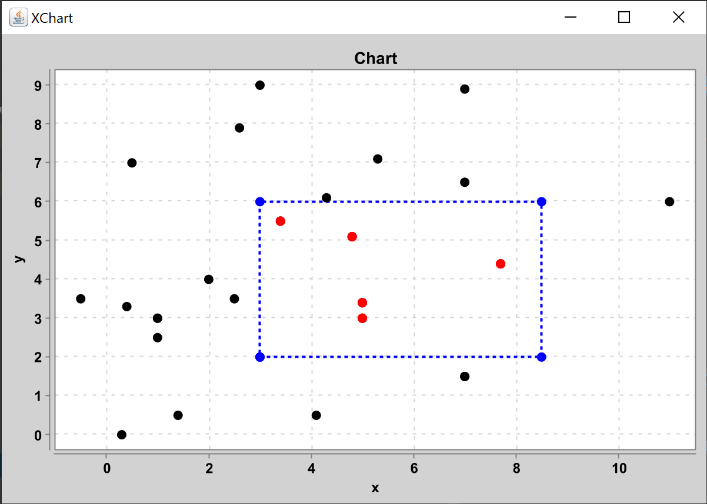

# Лабораторна робота 4 : Регіональний пошук методом 2D дерева

**Виконав студент групи ІПС-31**

**Точаненко Владислав Володимирович**

# Опис алгоритму & огляд коду

## Допоміжні класи

`Dot` - клас для зберігання координат точки та її куту відносно деякої точки, який буде вираховуватись далі.

```kotlin
data class Dot(
    var x: Double,
    var y: Double,
    var angle: Double = 0.0
)
```

`Line` - клас для зберігання відрізків.

```kotlin
data class Line(
    var start: Dot,
    var end: Dot
)
```

`Rectangle` - клас для зберігання прямокутників.

```kotlin
data class Rectangle(
        var bottomLeft: Dot,
        var topRight: Dot
) {
    fun toLine(): List<Dot> {
        return listOf<Dot>(
                Dot(bottomLeft.x, bottomLeft.y),
                Dot(topRight.x, bottomLeft.y),
                Dot(topRight.x, topRight.y),
                Dot(bottomLeft.x, topRight.y),
                Dot(bottomLeft.x, bottomLeft.y)
        )
    }
}
```

`Split` - перелічення для визначення типу розділення.

```kotlin
enum class Split {
    VERTICAL, HORIZONTAL
}
```

`TreeNode` - клас для зберігання одного вузла дерева.

```kotlin
data class TreeNode (
    var dot: Dot,
    var x: Double? = null,
    var y: Double? = null,
    var left: TreeNode? = null,
    var right: TreeNode? = null
)
```

## Основний алгоритм

### Короткий опис

Регіональний пошук методом 2D дерева використовується для знаходження точок, що знаходяться у деякому регіоні.

### Словесний опис алгоритму

Спочатку обираємо середню точку за координатою `x`. Проводимо вертикальну пряму через цю точку. Простір розділяється на 2 половини. У кожній з них обирається середня точка за координатою `y` і проводиться горизонтальний луч через кожну з ціх точок, що починається на вертикальній прямій і проходить через обрані точки. Повторюємо ці дії, поки не залишиться точок.

### Програмна реалізація

#### Допоміжні методи

Метод `buildTree` будує 2D дерево і повертає його корінь.

```kotlin
private fun buildTree(dots: List<Dot>, split: Split = Split.VERTICAL): TreeNode? {
    if (dots.size == 1)
        return TreeNode(dots[0])
    else if (dots.isEmpty())
        return null

    val median = findMedian(dots, split)
    val dot = dots[median]
    val x: Double?
    val y: Double?
    val nextSplit: Split
    if (split == Split.VERTICAL) {
        nextSplit = Split.HORIZONTAL
        x = dot.x
        y = null
    } else {
        nextSplit = Split.VERTICAL
        x = null
        y = dot.y
    }

    val node = TreeNode(dot, x = x, y = y)
    node.left = buildTree(dots.subList(0, median), nextSplit)
    node.right = buildTree(dots.subList(median, dots.size), nextSplit)
    return node
}
```

Метод `findDotsInRectangle` проходить по дереву і виводить у консоль чи іде алгоритм у деякий прямокутник, чи ні.

```kotlin
private fun findDotsInRectangle(node: TreeNode?, rectangle: Rectangle) {
    if (node == null)
        return
    if (isInRectangle(node.dot, rectangle))
        result.add(node.dot)
    if (isOutside(node, rectangle)) {
        println("${node.dot.x} --- ${node.dot.y} for left")
        findDotsInRectangle(node.left, rectangle)
    }
    if (isOutside(node, rectangle)) {
        println("${node.dot.x} --- ${node.dot.y} for right")
        findDotsInRectangle(node.right, rectangle)
    }
    if (!isOutside(node, rectangle) && !isOutside(node, rectangle))
        println("${node.dot.x} --- ${node.dot.y} ${"SKIPPED".red()}")
}
```

Метод `equalDelta` потрібен для порівнювання змінних типу `Double`.

```kotlin
private fun equalDelta(a: Double, b: Double, delta: Double =
    .1.pow(8)): Boolean = kotlin.math.abs(a - b) < delta
```

Метод `isOutside` визначає чи буде доречно розглядати крапки з деякого прямокутника, чи ні.

```kotlin
private fun isOutside(node: TreeNode, rectangle: Rectangle): Boolean {
    if (node.x == null && node.y != null) {
        return if (rectangle.topRight.y < node.y!! || equalDelta(rectangle.topRight.y, node.y!!)) {
            true
        } else if (rectangle.bottomLeft.y < node.y!! || equalDelta(rectangle.bottomLeft.y, node.y!!)) {
            true
        } else {
            true
        }
    } else if (node.x != null && node.y == null) {
        return if (rectangle.topRight.x <= node.x!! || equalDelta(rectangle.topRight.x, node.x!!)) {
            true
        } else if (rectangle.bottomLeft.x < node.x!! || equalDelta(rectangle.bottomLeft.x, node.x!!)) {
            true
        } else {
            true
        }
    }

    return false
}
```

Метод `findMedian` сортує точки в залежності від типу розділення, та повертає індекс середнього елементу.

```kotlin
private fun findMedian(dots: List<Dot>, type: Split): Int {
    if (type == Split.VERTICAL)
        dots.sortedBy { dot -> dot.x }
    if (type == Split.HORIZONTAL)
        dots.sortedBy { dot -> dot.y }
    return dots.size / 2
}
```

Метод `isInRectangle` визначає належність точки до прямокутника.

```kotlin
private fun isInRectangle(dot: Dot, rectangle: Rectangle): Boolean {
    return (dot.x >= rectangle.bottomLeft.x && dot.x <= rectangle.topRight.x)
            && (dot.y >= rectangle.bottomLeft.y && dot.y <= rectangle.topRight.y)
}
```

#### Основний алгоритм

Будуємо дерево та отримаємо його корінь. Знаходимо усі точки, що належать до прямокутника і повертаємо їх як список.

```kotlin
val root = buildTree(dots)
findDotsInRectangle(root, rectangle)
return result
```

### Побудова графіку

Для побудови графіку була використана бібліотека [xChart](https://github.com/knowm/XChart).

Клас `ChartLine` є допоміжним. Він зберігає список точок як послідовність точок ламаної, а також автоматично надає кожній ламаній унікальну назву, щоб на графіку не було конфліктів.

Клас `Chart` використовується для зберігання ліній та точок, які потім можуть бути відображені на графіку.

* `addLine(List<Dot>)` - як аргумент приймає список точок та додає їх як ламану, що буде намальована на графіку
* `addLine(ChartLine)` - як аргумент приймає об'єкт лінії на графіку та додає як ламану, що буде намальована на графіку
* `addDots(List<Dot>)` - як аргумент приймає список точок та додає їх у список точок, що будуть намальовані на графіку
* `addHighlightedDots(List<Dot>)` - як аргумент приймає список точок та додає їх у список точок, що будуть намальовані на графіку та виділені особливим кольором
* `draw()` - малює графік

### Функція `main`

Спочатку задаємо `dots` як список точок. Також задаємо регіон у вигляді прямокутника, у котрому будемо шукати точки. Далі створюється об'єкт графіку, додаються початкові точки, прямокутник, і список крапок, що є результатом роботи методу `Tree2D.calculate(dots, rectangle)`, додаються знайдені крапки, а далі цей графік малюється.

```kotlin
fun main() {
    val dots = listOf(
        ...
    )

    val rectangle = Rectangle(Dot(3.0, 2.0), Dot(8.5, 6.0))

    val chart = Chart()
    chart.addDots(dots)
    chart.addHighlightedDots(Tree2D.calculate(dots, rectangle))
    chart.addLine(rectangle.toLine())
    chart.draw()
}
```
### Приклад виконання

```kotlin
val dots = listOf(
    Dot(1.0, 3.0),
    Dot(2.0, 4.0),
    Dot(5.0, 3.0),
    Dot(1.0, 3.0),
    Dot(7.0, 6.5),
    Dot(4.3, 6.1),
    Dot(1.0, 2.5),
    Dot(0.3, 0.0),
    Dot(7.0, 1.5),
    Dot(7.0, 1.5),
    Dot(11.0, 6.0),
    Dot(3.0, 9.0),
    Dot(0.5, 7.0),
    Dot(-0.5, 3.5),
    Dot(5.3, 7.1),
    Dot(1.4,0.5),
    Dot(3.4,5.5),
    Dot(7.0,8.9),
    Dot(0.4,3.3),
    Dot(7.7,4.4),
    Dot(5.0,3.4),
    Dot(4.8,5.1),
    Dot(2.5,3.5),
    Dot(2.6,7.9),
    Dot(4.1, 0.5)
)

val rectangle = Rectangle(Dot(3.0, 2.0), Dot(8.5, 6.0))
```



## Повний код

### `Main.kt`

```kotlin
fun main() {
    val dots = listOf(
        Dot(1.0, 3.0),
        Dot(2.0, 4.0),
        Dot(5.0, 3.0),
        Dot(1.0, 3.0),
        Dot(7.0, 6.5),
        Dot(4.3, 6.1),
        Dot(1.0, 2.5),
        Dot(0.3, 0.0),
        Dot(7.0, 1.5),
        Dot(7.0, 1.5),
        Dot(11.0, 6.0),
        Dot(3.0, 9.0),
        Dot(0.5, 7.0),
        Dot(-0.5, 3.5),
        Dot(5.3, 7.1),
        Dot(1.4,0.5),
        Dot(3.4,5.5),
        Dot(7.0,8.9),
        Dot(0.4,3.3),
        Dot(7.7,4.4),
        Dot(5.0,3.4),
        Dot(4.8,5.1),
        Dot(2.5,3.5),
        Dot(2.6,7.9),
        Dot(4.1, 0.5)
    )

    val rectangle = Rectangle(Dot(3.0, 2.0), Dot(8.5, 6.0))

    val chart = Chart()
    chart.addDots(dots)
    chart.addHighlightedDots(Tree2D.calculate(dots, rectangle))
    chart.addLine(rectangle.toLine())
    chart.draw()
}
```

### `Tree2D.kt`

```kotlin
import kotlin.math.pow

class Tree2D {
    companion object {
        private var result = mutableListOf<Dot>()

        fun calculate(dots: List<Dot>, rectangle: Rectangle): List<Dot> {
            val root = buildTree(dots)
            findDotsInRectangle(root, rectangle)
            return result
        }

        private fun buildTree(dots: List<Dot>, split: Split = Split.VERTICAL): TreeNode? {
            if (dots.size == 1)
                return TreeNode(dots[0])
            else if (dots.isEmpty())
                return null

            val median = findMedian(dots, split)
            val dot = dots[median]
            val x: Double?
            val y: Double?
            val nextSplit: Split
            if (split == Split.VERTICAL) {
                nextSplit = Split.HORIZONTAL
                x = dot.x
                y = null
            } else {
                nextSplit = Split.VERTICAL
                x = null
                y = dot.y
            }

            val node = TreeNode(dot, x = x, y = y)
            node.left = buildTree(dots.subList(0, median), nextSplit)
            node.right = buildTree(dots.subList(median, dots.size), nextSplit)
            return node
        }

        private fun findDotsInRectangle(node: TreeNode?, rectangle: Rectangle) {
            if (node == null)
                return
            if (isInRectangle(node.dot, rectangle))
                result.add(node.dot)
            if (isOutside(node, rectangle)) {
                println("${node.dot.x} --- ${node.dot.y} for left")
                findDotsInRectangle(node.left, rectangle)
            }
            if (isOutside(node, rectangle)) {
                println("${node.dot.x} --- ${node.dot.y} for right")
                findDotsInRectangle(node.right, rectangle)
            }
            if (!isOutside(node, rectangle) && !isOutside(node, rectangle))
                println("${node.dot.x} --- ${node.dot.y} ${"SKIPPED".red()}")
        }

        private fun equalDelta(a: Double, b: Double, delta: Double = .1.pow(8)): Boolean = kotlin.math.abs(a - b) < delta

        private fun isOutside(node: TreeNode, rectangle: Rectangle): Boolean {
            if (node.x == null && node.y != null) {
                return if (rectangle.topRight.y < node.y!! || equalDelta(rectangle.topRight.y, node.y!!)) {
                    true
                } else if (rectangle.bottomLeft.y < node.y!! || equalDelta(rectangle.bottomLeft.y, node.y!!)) {
                    true
                } else {
                    true
                }
            } else if (node.x != null && node.y == null) {
                return if (rectangle.topRight.x <= node.x!! || equalDelta(rectangle.topRight.x, node.x!!)) {
                    true
                } else if (rectangle.bottomLeft.x < node.x!! || equalDelta(rectangle.bottomLeft.x, node.x!!)) {
                    true
                } else {
                    true
                }
            }

            return false
        }

        private fun findMedian(dots: List<Dot>, type: Split): Int {
            if (type == Split.VERTICAL)
                dots.sortedBy { dot -> dot.x }
            if (type == Split.HORIZONTAL)
                dots.sortedBy { dot -> dot.y }
            return dots.size / 2
        }

        private fun isInRectangle(dot: Dot, rectangle: Rectangle): Boolean {
            return (dot.x >= rectangle.bottomLeft.x && dot.x <= rectangle.topRight.x)
                    && (dot.y >= rectangle.bottomLeft.y && dot.y <= rectangle.topRight.y)
        }
    }
}
```

### `TreeNode.kt`

```kotlin
data class TreeNode (
    var dot: Dot,
    var x: Double? = null,
    var y: Double? = null,
    var left: TreeNode? = null,
    var right: TreeNode? = null
)
```

### `Rectangle.kt`

```kotlin
data class Rectangle(
        var bottomLeft: Dot,
        var topRight: Dot
) {
    fun toLine(): List<Dot> {
        return listOf<Dot>(
                Dot(bottomLeft.x, bottomLeft.y),
                Dot(topRight.x, bottomLeft.y),
                Dot(topRight.x, topRight.y),
                Dot(bottomLeft.x, topRight.y),
                Dot(bottomLeft.x, bottomLeft.y)
        )
    }
}
```

### `Line.kt`

```kotlin
data class Line(
    var start: Dot,
    var end: Dot
)
```

### `Dot.kt`

```kotlin
data class Dot(
    var x: Double,
    var y: Double,
    var angle: Double = 0.0
)
```

### `Split.kt`

```kotlin
enum class Split {
    VERTICAL, HORIZONTAL
}
```

### `Chart.kt`

```kotlin
import org.knowm.xchart.QuickChart
import org.knowm.xchart.SwingWrapper
import org.knowm.xchart.XYChart
import org.knowm.xchart.style.lines.SeriesLines
import org.knowm.xchart.style.markers.SeriesMarkers
import java.awt.Color

class Chart(
    private val chartName: String = "Chart",
    private val xName: String = "x",
    private val yName: String = "y"
) {

    private val chart: XYChart =
        QuickChart.getChart(
            chartName, xName, yName, "0, 0",
            doubleArrayOf(0.0), doubleArrayOf(0.0)
        )

    private var lines = mutableListOf<ChartLine>()
    private var dots = mutableListOf<Dot>()
    private var highlightedDots = mutableListOf<Dot>()

    fun addLine(dots: List<Dot>) {
        lines.add(ChartLine(dots))
    }

    fun addDots(dots: List<Dot>) {
        for (i in dots.indices) {
            this.dots.add(dots[i])
        }
    }

    fun addHighlightedDots(dots: List<Dot>) {
        for (i in dots.indices) {
            this.highlightedDots.add(dots[i])
        }
    }

    fun addLine(line: ChartLine) {
        lines.add(line)
    }

    fun draw() {
        for (line in lines)
            chart.addSeries(line.lineName, line.xData, line.yData)
                .setMarker(SeriesMarkers.CIRCLE).setMarkerColor(Color.BLUE).setLineColor(Color.BLUE).setLineStyle(SeriesLines.DASH_DASH)

        for (i in dots.indices)
            chart.addSeries("dot#$i", doubleArrayOf(dots[i].x), doubleArrayOf(dots[i].y))
                .setMarkerColor(Color.BLACK).setMarker(SeriesMarkers.CIRCLE)

        for (i in highlightedDots.indices)
            chart.addSeries("dot#${i + dots.size}", doubleArrayOf(highlightedDots[i].x), doubleArrayOf(highlightedDots[i].y))
                    .setMarkerColor(Color.RED).setMarker(SeriesMarkers.CIRCLE)

        SwingWrapper(chart).displayChart()
    }
}
```

### `ChartLine.kt`

```kotlin
class ChartLine(
    var xData: DoubleArray,
    var yData: DoubleArray,
    var lineName: String = "#"
) {
    constructor(dots: List<Dot>) : this(DoubleArray(dots.size), DoubleArray(dots.size)) {
        for (i: Int in dots.indices) {
            xData[i] = dots[i].x
            yData[i] = dots[i].y
        }
    }

    init {
        if (lineName == "#") {
            lineName += id++
        }
    }
}

private var id = 1
```