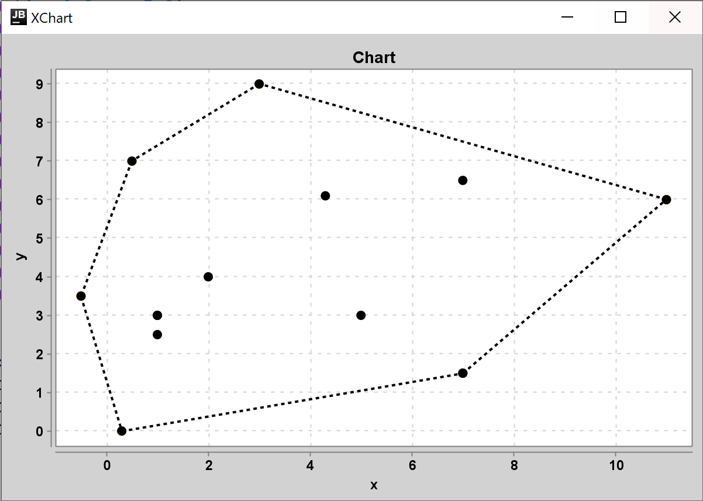

# Лабораторна робота 5 : Алгоритм QuickHull

**Виконав студент групи ІПС-31**

**Точаненко Владислав Володимирович**

# Опис алгоритму & огляд коду

## Допоміжні класи

`Dot` - клас для зберігання координат точки та її куту відносно деякої точки, який буде вираховуватись далі.

```kotlin
data class Dot(
    var x: Double,
    var y: Double,
    var angle: Double = 0.0
)
```

`Line` - клас для зберігання відрізків.

```kotlin
data class Line(
    val start: Dot,
    val end: Dot
)
```

## Основний алгоритм

### Короткий опис

Метод QuickHull використовується для обчислення опуклої оболонки скінченної множини точок. Він використовує підхід "розподіляй и володарюй", тобто задача на кожній ітерації розбивається на маліші приблизно однакового розміру.

### Словесний опис алгоритму

Обираємо найлівішу і найправішу точки, котрі будуть початковими. З кожної сторони від отриманого відрізку будемо обирати точку, що лежить далі за всі точки. Її можна обрати декількома принципами. Один з них - обирати точку, у котрій довжина проекції найдовша. Другий принцип - обирати точку, яка утворює трикутник з початковими точками з найбільшою площею.

### Програмна реалізація

#### Допоміжні методи

Метод `furthestDotIndex` знаходить індекс найдальшої точки для даного відрізку з одної з двох сторін.

```kotlin
private fun furthestDotIndex(dots: List<Dot>, line: Line, side: Int): Int {
    var furthest = -1
    var maxDistance = 0.0

    for (i in dots.indices) {
        val temp = dotToLineDistance(line, dots[i])
        if (side(line, dots[i]) == side && temp > maxDistance) {
            furthest = i
            maxDistance = temp
        }
    }

    return furthest
}
```

Метод `side` повертає з якої сторони від відрізку знаходиться конкретна точка.

```kotlin
private fun side(line: Line, dot: Dot): Int {
    val sub = (dot.y - line.start.y) * (line.end.x - line.start.x) -
            (line.end.y - line.start.y) * (dot.x - line.start.x)

    return when {
        sub == 0.0 -> 0
        sub > 0 -> 1
        else -> -1
    }
}
```

Метод `dotToLineDistance` повертає **пропорційну** довжину від точки до прямої. Тобто це не точна довжина, а якесь пропорційне значення. Нам не важливо знати яка відстань конкретно, важливо знати яка з них найбільша.

```kotlin
private fun dotToLineDistance(line: Line, dot: Dot): Double {
    return abs(
        (dot.y - line.start.y) * (line.end.x - line.start.x) -
                (line.end.y - line.start.y) * (dot.x - line.start.x)
    )
}
```

Метод `sortByAngle` буде використовуватись після виконання алгоритму щоб відсортувати точки за кутом відносно їхнього баріцентру. Без цього сортуванню лінії в ломаній будуть утворювати не опуклу оболонку, а ломану, що у довільному порядку з'єднує точки оболонки.

```kotlin
private fun sortByAngle() {
    val center = Dot(0.0, 0.0)
    for (dot in result) {
        center.x += dot.x / result.size
        center.y += dot.y / result.size
    }

    result.map { it.angle = atan2(it.y - center.y, it.x - center.x) * 180 / PI }
    result.sortBy { it.angle }

    result.add(result[0])
}
```

#### Основний алгоритм

Побудувати опуклу оболонку можливо для трьох та більше точок. Тому спочатку треба перевірити чи кількість даних точок більша за 2.

```kotlin
assert(dots.size > 2)
```

Тепер знаходимо індекси найлівішої та найправішої точок.

```kotlin
var minX = 0
var maxX = 0

// Find most left and right dots
for (i in dots.indices) {
    if (dots[i].x < dots[minX].x)
        minX = i
    if (dots[i].x > dots[maxX].x)
        maxX = i
}
```

Знаходимо точки, що належать до опуклої оболонки, завдяки рекурсивному методу `quickHull`, який приймає як параметри список усіх точок, пряму, відносно котрої розглядаємо, та сторону з якої розглядаємо.

```kotlin
quickHull(dots, Line(dots[minX], dots[maxX]), 1)
quickHull(dots, Line(dots[minX], dots[maxX]), -1)
```

Метод `quickHull` шукає чи існує найдальша точка для даного відрізку з даної сторони і, якщо не існує - додає точки відрізка у результат. Якщо ж існує - розбиває задачу на менші таким чином: виконує метод `quickHull` для кожного з відрізків, початок котрого є ця найдальша точка, а кінець - одна з крайніх точок відрізку. При цьому розглядається задача тільки для "зовнішньої" сторони.

```kotlin
private fun quickHull(dots: List<Dot>, line: Line, side: Int) {
    val furthest = furthestDotIndex(dots, line, side)

    if (furthest == -1) {
        result.add(line.start)
        result.add(line.end)
        return
    }

    quickHull(
        dots,
        Line(dots[furthest], line.start),
        -side(Line(dots[furthest], line.start), line.end)
    )

    quickHull(
        dots,
        Line(dots[furthest], line.end),
        -side(Line(dots[furthest], line.end), line.start)
    )
}
```

Після знаходження всіх точок, що належать до опуклої оболонки, ми їх сортуємо і повертаємо як результат обчислення.

```kotlin
sortByAngle()
return result
```

### Побудова графіку

Для побудови графіку була використана бібліотека [xChart](https://github.com/knowm/XChart).

Клас `ChartLine` є допоміжним. Він зберігає список точок як послідовність точок ламаної, а також автоматично надає кожній ламаній унікальну назву, щоб на графіку не було конфліктів.

Клас `Chart` використовується для зберігання ліній та точок, які потім можуть бути відображені на графіку.

* `addLine(List<Dot>)` - як аргумент приймає список точок та додає їх як ламану, що буде намальована на графіку
* `addDots(List<Dot>)` - як аргумент приймає список точок та додає їх у список точок, що будуть намальовані на графіку
* `draw()` - малює графік

### Функція `main`

Спочатку задаємо `dots` як список точок, по яким буде будуватись опукла оболонка. Далі створюється об'єкт графіку, додаються початкові точки і ламана, що є результатом роботи методу `QuickHull.calculate(dots)`, а далі цей графік малюється.

```kotlin
fun main() {
    val dots = listOf(
        ...
    )

    val chart = Chart()
    chart.addDots(dots)
    chart.addLine(QuickHull.calculate(dots))
    chart.draw()
}
```

### Приклад виконання

```kotlin
val dots = listOf(
    Dot(1.0, 3.0),
    Dot(2.0, 4.0),
    Dot(5.0, 3.0),
    Dot(1.0, 3.0),
    Dot(7.0, 6.5),
    Dot(4.3, 6.1),
    Dot(1.0, 2.5),
    Dot(0.3, 0.0),
    Dot(7.0, 1.5),
    Dot(7.0, 1.5),
    Dot(11.0, 6.0),
    Dot(3.0, 9.0),
    Dot(0.5, 7.0),
    Dot(-0.5, 3.5)
)
```



## Повний код

### `Main.kt`

```kotlin
fun main() {
    val dots = listOf(
        Dot(1.0, 3.0),
        Dot(2.0, 4.0),
        Dot(5.0, 3.0),
        Dot(1.0, 3.0),
        Dot(7.0, 6.5),
        Dot(4.3, 6.1),
        Dot(1.0, 2.5),
        Dot(0.3, 0.0),
        Dot(7.0, 1.5),
        Dot(7.0, 1.5),
        Dot(11.0, 6.0),
        Dot(3.0, 9.0),
        Dot(0.5, 7.0),
        Dot(-0.5, 3.5)
    )

    val chart = Chart()
    chart.addDots(dots)
    chart.addLine(QuickHull.calculate(dots))
    chart.draw()
}
```

### `QuickHull.kt`

```kotlin
import kotlin.math.PI
import kotlin.math.abs
import kotlin.math.atan2

class QuickHull {
    companion object {
        private var result = mutableListOf<Dot>()

        fun calculate(dots: List<Dot>): List<Dot> {
            assert(dots.size > 2)

            var minX = 0
            var maxX = 0

            // Find most left and right dots
            for (i in dots.indices) {
                if (dots[i].x < dots[minX].x)
                    minX = i
                if (dots[i].x > dots[maxX].x)
                    maxX = i
            }

            quickHull(dots, Line(dots[minX], dots[maxX]), 1)
            quickHull(dots, Line(dots[minX], dots[maxX]), -1)

            sortByAngle()

            return result
        }

        private fun quickHull(dots: List<Dot>, line: Line, side: Int) {
            val furthest = furthestDotIndex(dots, line, side)

            if (furthest == -1) {
                result.add(line.start)
                result.add(line.end)
                return
            }

            quickHull(
                dots,
                Line(dots[furthest], line.start),
                -side(Line(dots[furthest], line.start), line.end)
            )

            quickHull(
                dots,
                Line(dots[furthest], line.end),
                -side(Line(dots[furthest], line.end), line.start)
            )
        }

        private fun furthestDotIndex(dots: List<Dot>, line: Line, side: Int): Int {
            var furthest = -1
            var maxDistance = 0.0

            for (i in dots.indices) {
                val temp = dotToLineDistance(line, dots[i])
                if (side(line, dots[i]) == side && temp > maxDistance) {
                    furthest = i
                    maxDistance = temp
                }
            }

            return furthest
        }

        private fun side(line: Line, dot: Dot): Int {
            val sub = (dot.y - line.start.y) * (line.end.x - line.start.x) -
                    (line.end.y - line.start.y) * (dot.x - line.start.x)

            return when {
                sub == 0.0 -> 0
                sub > 0 -> 1
                else -> -1
            }
        }

        private fun dotToLineDistance(line: Line, dot: Dot): Double {
            return abs(
                (dot.y - line.start.y) * (line.end.x - line.start.x) -
                        (line.end.y - line.start.y) * (dot.x - line.start.x)
            )
        }

        private fun sortByAngle() {
            val center = Dot(0.0, 0.0)
            for (dot in result) {
                center.x += dot.x / result.size
                center.y += dot.y / result.size
            }

            result.map { it.angle = atan2(it.y - center.y, it.x - center.x) * 180 / PI }
            result.sortBy { it.angle }

            result.add(result[0])
        }
    }
}
```

### `Line.kt`

```kotlin
data class Line(
    val start: Dot,
    val end: Dot
)
```

### `Dot.kt`

```kotlin
data class Dot(
    var x: Double,
    var y: Double,
    var angle: Double = 0.0
)
```

### `Chart.kt`

```kotlin
import org.knowm.xchart.QuickChart
import org.knowm.xchart.SwingWrapper
import org.knowm.xchart.XYChart
import org.knowm.xchart.style.lines.SeriesLines
import org.knowm.xchart.style.markers.SeriesMarkers
import java.awt.Color

class Chart(
    private val chartName: String = "Chart",
    private val xName: String = "x",
    private val yName: String = "y"
) {

    private val chart: XYChart =
        QuickChart.getChart(
            chartName, xName, yName, "0, 0",
            doubleArrayOf(0.0), doubleArrayOf(0.0)
        )

    private var lines = mutableListOf<ChartLine>()
    private var dots = mutableListOf<Dot>()

    fun addLine(dots: List<Dot>) {
        lines.add(ChartLine(dots))
    }

    fun addDots(dots: List<Dot>) {
        for (i in dots.indices) {
            this.dots.add(dots[i])
        }
    }

    fun draw() {
        for (line in lines)
            chart.addSeries(line.lineName, line.xData, line.yData)
                .setMarker(SeriesMarkers.CIRCLE).setLineColor(Color.BLACK).setLineStyle(SeriesLines.DASH_DASH);


        for (i in dots.indices)
            chart.addSeries("dot#$i", doubleArrayOf(dots[i].x), doubleArrayOf(dots[i].y))
                .setMarkerColor(Color.BLACK).setMarker(SeriesMarkers.CIRCLE)

        SwingWrapper(chart).displayChart()
    }
}
```

### `ChartLine.kt`

```kotlin
class ChartLine(
    var xData: DoubleArray,
    var yData: DoubleArray,
    var lineName: String = "#"
) {
    constructor(dots: List<Dot>) : this(DoubleArray(dots.size), DoubleArray(dots.size)) {
        for (i: Int in dots.indices) {
            xData[i] = dots[i].x
            yData[i] = dots[i].y
        }
    }

    init {
        if (lineName == "#") {
            lineName += id++
        }
    }
}

private var id = 1
```