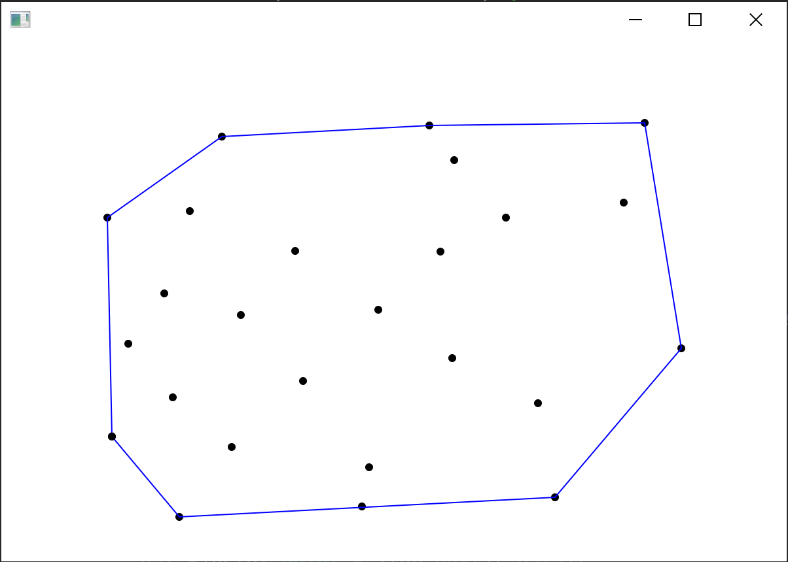

# Лабораторна робота 7 : Динамічні алгоритми побудови опуклої оболонки. Алгоритм Препарати

**Виконав студент групи ІПС-31**

**Точаненко Владислав Володимирович**

# Опис алгоритму & огляд коду

## Допоміжні класи 

`Node` - Клас для зберігання одного елементу циклічного списку.

```kotlin
class Node<T>(var data: T) {
    var prev: Node<T>? = null
    var next: Node<T>? = null
}
```

`CircularList` - клас циклічного списку.

```kotlin
class CircularList<T> {
    private var root: Node<T>? = null
    private var tail: Node<T>? = null
    private var size = 0

    fun size(): Int {
        return size
    }

    fun insertToEnd(data: T): Node<T> {
        size++
        val node: Node<T> = Node(data)
        if (root == null) {
            root = node
            root?.next = root
            root?.prev = root
            tail = root
            return node
        }
        tail?.next = node
        node.prev = tail
        node.next = root
        tail = node
        root?.prev = tail
        return node
    }

    fun getRoot(): Node<T>? {
        return root
    }

    fun insertAfter(node: Node<T>, data: T): Node<T> {
        val newNode: Node<T> = Node(data)
        newNode.next = node.next
        newNode.prev = node
        node.next = newNode
        newNode.next?.prev = newNode
        if (node === tail) {
            tail = newNode
            root?.prev = tail
        }
        return newNode
    }

    fun splitNext(nodeA: Node<T>, nodeB: Node<T>) {
        nodeA.next = nodeB
        nodeB.prev = nodeA
        root = nodeA
        tail = nodeA.prev
    }
}
```

`Point` - клас для зберігання точки.

```kotlin
import java.util.*
import kotlin.math.abs

class Point(var x: Double, var y: Double) {

    override fun toString(): String {
        return "{" +
                +x +
                ", " + y +
                '}'
    }

    override fun equals(other: Any?): Boolean {
        if (this === other) return true
        if (other == null || javaClass != other.javaClass) return false
        val point = other as Point
        return equal(point.x, x) &&
                equal(point.y, y)
    }

    override fun hashCode(): Int {
        return Objects.hash(x, y)
    }

    companion object {

        fun area(a: Point, b: Point, c: Point): Double {
            return (b.x - a.x) * (c.y - a.y) - (b.y - a.y) * (c.x - a.x)
        }

        fun equal(a: Double, b: Double): Boolean {
            return abs(a - b) < 1e-4
        }

    }

}
```

## Основний алгоритм

### Короткий опис

Алгоритм препарати використовується для динамічної підтримки опуклої оболонки. Його також можна використовувати для її побудови.

### Словесний опис алгоритму

Вставляючи нову точку, проводимо відрізок від поточної вершини опуклої оболонки, що розглядається, та, в залежності від типу цієї вершини, додаємо цю точку до опуклої оболонки, чи ні. Якщо додали, видаляємо непотрібний ланцюг з опуклої оболонки.

### Програмна реалізація

#### Допоміжні методи

Необхідно ефективно будувати опорні прямі та вилучати низку вершин між опорними точками.

Для цього маємо класифікувати кожну вершину відносно відрізка VP (V – вершина опуклої оболонки, P — точка, яку перевіряємо):

* Ввігнута – відрізок PV перетинає внутрішню частину оболонки;
* Опорна – дві суміжні з v вершини лежать по один бік від прямої, яка проходить через точки P та V;
* Опукла: інакше.

Шукаємо опорні прямі. Якщо точка V – не є опорною, то рухаємось за або проти руху годинникової стрілки, залежно від того ввігнута чи опукла вершина.

Це все виконує метод `updateHull`:

```kotlin
private fun updateHull(hull: CircularList<Point?>, point: Point) {
    var curPoint: Node<Point?>? = null

    if (hull.size() >= 3) {

        val distLeft: Double = abs(point.x - leftNode!!.data!!.x)
        val distRight: Double = abs(point.x - rightNode!!.data!!.x)
        val startPoint: Node<Point?>

        startPoint = (if (distLeft > distRight) rightNode else leftNode)!!

        var topPoint: Node<Point?> = startPoint
        var bottomPoint: Node<Point?> = startPoint
        var topFound = false
        var bottomFound = false
        var inside: Boolean
        var firstBottomTime = true
        var firstTopTime = true
        var steps = 0

        do {
            steps++

            var a: Double = sign(Point.area(point, topPoint.data!!, topPoint.next!!.data!!))
            var b: Double = sign(Point.area(point, topPoint.data!!, topPoint.prev!!.data!!))

            inside = (!firstTopTime && topPoint === startPoint
                    || !firstBottomTime && bottomPoint === startPoint)

            if (!topFound && (a != b || b <= 0)) {
                topPoint = topPoint.next!!
                firstTopTime = false
            } else
                topFound = true

            a = sign(Point.area(point, bottomPoint.data!!, bottomPoint.next!!.data!!))
            b = sign(Point.area(point, bottomPoint.data!!, bottomPoint.prev!!.data!!))

            if (!bottomFound && (a != b || a >= 0)) {
                firstBottomTime = false
                bottomPoint = bottomPoint.prev!!
            } else
                bottomFound = true
        } while (steps < 5000 && !inside && (!topFound || !bottomFound))

        if (inside)
            return
        if (steps >= 5000) {
            println("Something went wrong, reverting")
            return
        }

        hull.splitNext(bottomPoint, topPoint)
        curPoint = hull.insertAfter(bottomPoint, point)

        context!!.stroke = Color.BLUE
        drawPoint(topPoint.data!!)
        drawPoint(bottomPoint.data!!)
        context!!.stroke = Color.BLACK
    } else if (hull.size() < 3)
        curPoint = hull.insertToEnd(point)

    if (leftNode == null || leftNode!!.data!!.x > point.x)
        leftNode = curPoint
    if (rightNode == null || rightNode!!.data!!.x < point.x)
        rightNode = curPoint
}
```

Знаходимо опорні точки, та вилучаємо ланцюг між ними. Для того, щоб ефективно вилучати ланцюги та вставляти нові точки використовуємо зчеплену чергу.

#### Основний алгоритм

Програма будує точки динамічно за допомогою технології JavaFX. Раджу запустити і подивитись як воно працює.

### Приклад виконання



## Повний код

### `Main.kt`

```kotlin
import javafx.application.Application
import javafx.fxml.FXMLLoader
import javafx.scene.Parent
import javafx.scene.Scene
import javafx.stage.Stage

class Main : Application() {
    @Throws(Exception::class)
    override fun start(primaryStage: Stage?) {
        val loader = FXMLLoader()
        loader.location = javaClass.getResource("form.fxml")
        val parent: Parent = loader.load()
        loader.setController(AppController())
        primaryStage!!.scene = Scene(parent)
        primaryStage.show()
    }

    companion object {
        @JvmStatic
        fun main(args: Array<String>) {
            launch(Main::class.java)
        }
    }
}
```

### `AppController.kt`

```kotlin
import javafx.fxml.FXML
import javafx.fxml.Initializable
import javafx.scene.canvas.Canvas
import javafx.scene.canvas.GraphicsContext
import javafx.scene.input.MouseEvent
import javafx.scene.paint.Color
import java.net.URL
import java.util.*
import kotlin.math.abs
import kotlin.math.sign

class AppController : Initializable {
    @FXML
    var canvas: Canvas? = null

    private var context: GraphicsContext? = null
    private val diameter = 6.0
    private var hull: CircularList<Point?> = CircularList()
    private val points: ArrayList<Point> = ArrayList<Point>()
    private var leftNode: Node<Point?>? = null
    private var rightNode: Node<Point?>? = null


    private fun updateHull(hull: CircularList<Point?>, point: Point) {
        var curPoint: Node<Point?>? = null

        if (hull.size() >= 3) {

            val distLeft: Double = abs(point.x - leftNode!!.data!!.x)
            val distRight: Double = abs(point.x - rightNode!!.data!!.x)
            val startPoint: Node<Point?>

            startPoint = (if (distLeft > distRight) rightNode else leftNode)!!

            var topPoint: Node<Point?> = startPoint
            var bottomPoint: Node<Point?> = startPoint
            var topFound = false
            var bottomFound = false
            var inside: Boolean
            var firstBottomTime = true
            var firstTopTime = true
            var steps = 0

            do {
                steps++

                var a: Double = sign(Point.area(point, topPoint.data!!, topPoint.next!!.data!!))
                var b: Double = sign(Point.area(point, topPoint.data!!, topPoint.prev!!.data!!))

                inside = (!firstTopTime && topPoint === startPoint
                        || !firstBottomTime && bottomPoint === startPoint)

                if (!topFound && (a != b || b <= 0)) {
                    topPoint = topPoint.next!!
                    firstTopTime = false
                } else
                    topFound = true

                a = sign(Point.area(point, bottomPoint.data!!, bottomPoint.next!!.data!!))
                b = sign(Point.area(point, bottomPoint.data!!, bottomPoint.prev!!.data!!))

                if (!bottomFound && (a != b || a >= 0)) {
                    firstBottomTime = false
                    bottomPoint = bottomPoint.prev!!
                } else
                    bottomFound = true
            } while (steps < 5000 && !inside && (!topFound || !bottomFound))

            if (inside)
                return
            if (steps >= 5000) {
                println("Something went wrong, reverting")
                return
            }

            hull.splitNext(bottomPoint, topPoint)
            curPoint = hull.insertAfter(bottomPoint, point)

            context!!.stroke = Color.BLUE
            drawPoint(topPoint.data!!)
            drawPoint(bottomPoint.data!!)
            context!!.stroke = Color.BLACK
        } else if (hull.size() < 3)
            curPoint = hull.insertToEnd(point)

        if (leftNode == null || leftNode!!.data!!.x > point.x)
            leftNode = curPoint
        if (rightNode == null || rightNode!!.data!!.x < point.x)
            rightNode = curPoint
    }

    override fun initialize(location: URL?, resources: ResourceBundle?) {
        context = canvas!!.graphicsContext2D
        onReset()
    }

    @FXML
    fun onReset() {
        context!!.fill = Color.BLACK
        context!!.clearRect(0.0, 0.0, canvas!!.width, canvas!!.height)
    }

    @FXML
    fun canvasClick(event: MouseEvent) {
        redraw()
        val x = event.x
        val y = event.y
        println("Click: $x $y")
        val point = Point(x, y)
        points.add(point)
        updateHull(hull, point)
        redraw()
        drawPoint(point)
    }

    private fun redraw() {
        context!!.clearRect(0.0, 0.0, canvas!!.width, canvas!!.height)
        context!!.stroke = Color.BLACK

        for (p in points) {
            drawPoint(p)
        }

        context!!.stroke = Color.BLUE
        var iter: Node<Point?> = hull.getRoot() ?: return
        if (iter.next == null) return
        val firstP: Point = iter.next!!.data!!
        iter = iter.next!!
        var secondP: Point? = firstP
        var p1: Point?

        do {
            p1 = iter.next!!.data
            iter = iter.next!!
            context!!.strokeLine(secondP!!.x, secondP.y, p1!!.x, p1.y)
            secondP = p1
        } while (iter !== hull.getRoot())

        context!!.strokeLine(firstP.x, firstP.y, secondP!!.x, secondP.y)
        context!!.stroke = Color.BLACK
    }

    private fun drawPoint(point: Point) {
        val x: Double = point.x
        val y: Double = point.y
        context!!.fillOval(x - diameter / 2, y - diameter / 2, diameter, diameter)
    }
}
```

### `CircularList.kt`

```kotlin
class CircularList<T> {
    private var root: Node<T>? = null
    private var tail: Node<T>? = null
    private var size = 0

    fun size(): Int {
        return size
    }

    fun insertToEnd(data: T): Node<T> {
        size++
        val node: Node<T> = Node(data)
        if (root == null) {
            root = node
            root?.next = root
            root?.prev = root
            tail = root
            return node
        }
        tail?.next = node
        node.prev = tail
        node.next = root
        tail = node
        root?.prev = tail
        return node
    }

    fun getRoot(): Node<T>? {
        return root
    }

    fun insertAfter(node: Node<T>, data: T): Node<T> {
        val newNode: Node<T> = Node(data)
        newNode.next = node.next
        newNode.prev = node
        node.next = newNode
        newNode.next?.prev = newNode
        if (node === tail) {
            tail = newNode
            root?.prev = tail
        }
        return newNode
    }

    fun splitNext(nodeA: Node<T>, nodeB: Node<T>) {
        nodeA.next = nodeB
        nodeB.prev = nodeA
        root = nodeA
        tail = nodeA.prev
    }
}
```

### `Node.kt`

```kotlin
class Node<T>(var data: T) {
    var prev: Node<T>? = null
    var next: Node<T>? = null
}
```

### `Edge.kt`

```kotlin
class Edge(var from: GraphNode, var to: GraphNode) {
    var weight = 0

    @Override
    override fun equals(other: Any?): Boolean {
        if (other is Edge)
            if (this.from == other.from && this.to == other.to) {
                return true
            }
        return false
    }

    fun swap() {
        val tmp = from
        from = to
        to = tmp
    }
}
```

### `Point.kt`

```kotlin
import java.util.*
import kotlin.math.abs

class Point(var x: Double, var y: Double) {

    override fun toString(): String {
        return "{" +
                +x +
                ", " + y +
                '}'
    }

    override fun equals(other: Any?): Boolean {
        if (this === other) return true
        if (other == null || javaClass != other.javaClass) return false
        val point = other as Point
        return equal(point.x, x) &&
                equal(point.y, y)
    }

    override fun hashCode(): Int {
        return Objects.hash(x, y)
    }

    companion object {

        fun area(a: Point, b: Point, c: Point): Double {
            return (b.x - a.x) * (c.y - a.y) - (b.y - a.y) * (c.x - a.x)
        }

        fun equal(a: Double, b: Double): Boolean {
            return abs(a - b) < 1e-4
        }

    }

}
```

### `form.fxml`

```xml
<?xml version="1.0" encoding="UTF-8"?>

<?import javafx.scene.canvas.Canvas?>
<?import javafx.scene.layout.BorderPane?>
<BorderPane maxHeight="-Infinity" maxWidth="-Infinity" minHeight="-Infinity" minWidth="-Infinity" prefHeight="400.0"
            prefWidth="600.0" xmlns="http://javafx.com/javafx/8.0.172-ea" xmlns:fx="http://javafx.com/fxml/1"
            fx:controller="AppController">
    <center>
        <Canvas fx:id="canvas" height="343.0" onMouseClicked="#canvasClick" width="602.0"/>
    </center>
</BorderPane>
```