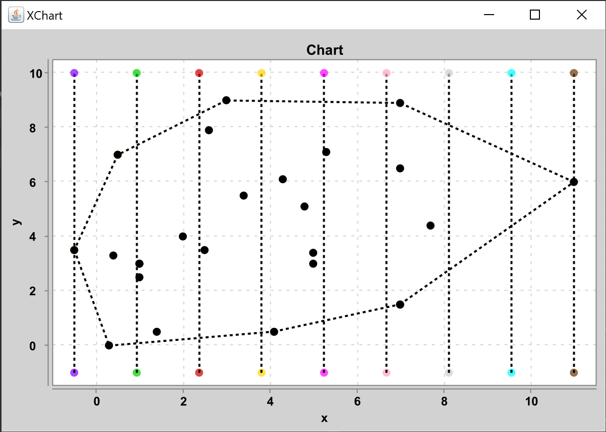

# Лабораторна робота 8 : Алгоритм апроксимації опуклої оболонки

**Виконав студент групи ІПС-31**

**Точаненко Владислав Володимирович**

# Опис алгоритму & огляд коду

## Допоміжні класи

`Dot` - клас для зберігання координат точки та її куту відносно деякої точки, який буде вираховуватись далі.

```kotlin
data class Dot(
    var x: Double,
    var y: Double,
    var angle: Double = 0.0
)
```

`Line` - клас для зберігання відрізків.

```kotlin
data class Line(
    val start: Dot,
    val end: Dot
)
```

## Основний алгоритм

### Короткий опис

Метод апроксимації опуклої оболонки використовується для приблизного обчислення опуклої оболонки скінченної множини точок.

### Словесний опис алгоритму

Обираємо найлівішу і найправішу точки. Розділяємо відрізок на певну кількість секторів. Знаходимо в кожному секторі найвищу і найнижчу точки і уже за ними будемо будувати опуклу оболонку за методом Джарвіса.

### Програмна реалізація

#### Допоміжні методи

Метод `getSides` повертає відрізок із початком у найлівішій точці і кінцем у найправішій точці.

```kotlin
private fun getSides(dots: List<Dot>): Line {
    val res = Line(dots[0], dots[1])
    for (dot in dots) {
        if (dot.x < res.start.x)
            res.start = dot
        if (dot.x > res.end.x)
            res.end = dot
    }
    return res
}
```

Метод `generateLines` генерує лінії-роздільники секторів, що будуть відображені на графіку. 

```kotlin
private fun generateLines(sides: Line, regions: Int, dots: List<Dot>) {
    var minY = sides.start.y
    var maxY = sides.start.y

    val sector = (sides.end.x - sides.start.x) / regions

    for (dot in dots) {
        if (dot.y > maxY)
            maxY = dot.y
        if (dot.y < minY)
            minY = dot.y
    }

    for (i in 0..regions) {
        lines.add(
            ChartLine(
                listOf(
                    Dot(i * sector + sides.start.x, minY - 1),
                    Dot(i * sector + sides.start.x, maxY + 1)
                )
            )
        )
    }
}
```

#### Основний алгоритм

Побудувати опуклу оболонку можливо для трьох та більше точок. Тому спочатку треба перевірити чи кількість даних точок більша за 2.

```kotlin
assert(dots.size > 2)
```

Знайти найлівішу і найправішу точки, а також побудувати лінії, що розділяють сектори.

```kotlin
val sides = getSides(dots)
val sector = (sides.end.x - sides.start.x) / regions

generateLines(sides, regions, dots)
```

Знаходимо найвищу і найнижчу точки у кожному секторі

```kotlin
val minDots = Array<Dot?>(regions + 1) { null }
val maxDots = Array<Dot?>(regions + 1) { null }

var dotSector: Int

for (dot in dots) {
    dotSector = ((dot.x - sides.start.x) / sector).toInt()
    if (maxDots[dotSector] == null || maxDots[dotSector]!!.y > dot.y)
        maxDots[dotSector] = dot
    if (minDots[dotSector] == null || minDots[dotSector]!!.y < dot.y)
        minDots[dotSector] = dot
}
```

Додаємо кожну таку точку у список точок, за якими будемо будувати оболонку. Також додаємо дві початкові точки.

```kotlin
for (i in 0 until regions) {
    if (minDots[i] != maxDots[i]) {
        if (minDots[i] != null)
            result.add(minDots[i]!!)
        if (maxDots[i] != null)
            result.add(maxDots[i]!!)
    } else if (minDots[i] != null) {
        result.add(minDots[i]!!)
    }
}

result.add(sides.start)
result.add(sides.end)
```

Повертаємо результат побудови оболонки за Джарвісом.

```kotlin
return GiftWrapper.calculate(result.toMutableList())
```

### Побудова графіку

Для побудови графіку була використана бібліотека [xChart](https://github.com/knowm/XChart).

Клас `ChartLine` є допоміжним. Він зберігає список точок як послідовність точок ламаної, а також автоматично надає кожній ламаній унікальну назву, щоб на графіку не було конфліктів.

Клас `Chart` використовується для зберігання ліній та точок, які потім можуть бути відображені на графіку.

* `addLine(List<Dot>)` - як аргумент приймає список точок та додає їх як ламану, що буде намальована на графіку
* `addLine(ChartLine)` - як аргумент приймає об'єкт лінії на графіку та додає як ламану, що буде намальована на графіку
* `addDots(List<Dot>)` - як аргумент приймає список точок та додає їх у список точок, що будуть намальовані на графіку
* `draw()` - малює графік

### Функція `main`

Спочатку задаємо `dots` як список точок, по яким буде будуватись опукла оболонка. Далі створюється об'єкт графіку, додаються початкові точки і ламана, що є результатом роботи методу `HullApproximation.approximate(dots, sectors)`, додаються лінії-роздільники секторів, а далі цей графік малюється.

```kotlin
fun main() {
    val dots = listOf(
        ...
    )

    val sectors = 8

    val chart = Chart()
    chart.addDots(dots)
    chart.addLine(HullApproximation.approximate(dots, sectors))
    for (line in HullApproximation.getLines())
        chart.addLine(line)
    chart.draw()
}
```

### Приклад виконання

```kotlin
val dots = listOf(
    Dot(1.0, 3.0),
    Dot(2.0, 4.0),
    Dot(5.0, 3.0),
    Dot(1.0, 3.0),
    Dot(7.0, 6.5),
    Dot(4.3, 6.1),
    Dot(1.0, 2.5),
    Dot(0.3, 0.0),
    Dot(7.0, 1.5),
    Dot(7.0, 1.5),
    Dot(11.0, 6.0),
    Dot(3.0, 9.0),
    Dot(0.5, 7.0),
    Dot(-0.5, 3.5),
    Dot(5.3, 7.1),
    Dot(1.4,0.5),
    Dot(3.4,5.5),
    Dot(7.0,8.9),
    Dot(0.4,3.3),
    Dot(7.7,4.4),
    Dot(5.0,3.4),
    Dot(4.8,5.1),
    Dot(2.5,3.5),
    Dot(2.6,7.9),
    Dot(4.1, 0.5)
)
```



## Повний код

### `Main.kt`

```kotlin
fun main() {
    val dots = listOf(
        Dot(1.0, 3.0),
        Dot(2.0, 4.0),
        Dot(5.0, 3.0),
        Dot(1.0, 3.0),
        Dot(7.0, 6.5),
        Dot(4.3, 6.1),
        Dot(1.0, 2.5),
        Dot(0.3, 0.0),
        Dot(7.0, 1.5),
        Dot(7.0, 1.5),
        Dot(11.0, 6.0),
        Dot(3.0, 9.0),
        Dot(0.5, 7.0),
        Dot(-0.5, 3.5),
        Dot(5.3, 7.1),
        Dot(1.4,0.5),
        Dot(3.4,5.5),
        Dot(7.0,8.9),
        Dot(0.4,3.3),
        Dot(7.7,4.4),
        Dot(5.0,3.4),
        Dot(4.8,5.1),
        Dot(2.5,3.5),
        Dot(2.6,7.9),
        Dot(4.1, 0.5)
    )

    val sectors = 8

    val chart = Chart()
    chart.addDots(dots)
    chart.addLine(HullApproximation.approximate(dots, sectors))
    for (line in HullApproximation.getLines())
        chart.addLine(line)
    chart.draw()
}
```

### `HullApproximation.kt`

```kotlin
class HullApproximation {
    companion object {
        private var result = mutableListOf<Dot>()
        private var lines = mutableListOf<ChartLine>()

        fun approximate(dots: List<Dot>, regions: Int): List<Dot> {
            assert(dots.size > 2)

            val sides = getSides(dots)
            val sector = (sides.end.x - sides.start.x) / regions

            generateLines(sides, regions, dots)

            val minDots = Array<Dot?>(regions + 1) { null }
            val maxDots = Array<Dot?>(regions + 1) { null }

            var dotSector: Int

            for (dot in dots) {
                dotSector = ((dot.x - sides.start.x) / sector).toInt()
                if (maxDots[dotSector] == null || maxDots[dotSector]!!.y > dot.y)
                    maxDots[dotSector] = dot
                if (minDots[dotSector] == null || minDots[dotSector]!!.y < dot.y)
                    minDots[dotSector] = dot
            }

            for (i in 0 until regions) {
                if (minDots[i] != maxDots[i]) {
                    if (minDots[i] != null)
                        result.add(minDots[i]!!)
                    if (maxDots[i] != null)
                        result.add(maxDots[i]!!)
                } else if (minDots[i] != null) {
                    result.add(minDots[i]!!)
                }
            }

            result.add(sides.start)
            result.add(sides.end)

            return GiftWrapper.calculate(result.toMutableList())
        }

        private fun getSides(dots: List<Dot>): Line {
            val res = Line(dots[0], dots[1])
            for (dot in dots) {
                if (dot.x < res.start.x)
                    res.start = dot
                if (dot.x > res.end.x)
                    res.end = dot
            }
            return res
        }

        private fun generateLines(sides: Line, regions: Int, dots: List<Dot>) {
            var minY = sides.start.y
            var maxY = sides.start.y

            val sector = (sides.end.x - sides.start.x) / regions

            for (dot in dots) {
                if (dot.y > maxY)
                    maxY = dot.y
                if (dot.y < minY)
                    minY = dot.y
            }

            for (i in 0..regions) {
                lines.add(
                    ChartLine(
                        listOf(
                            Dot(i * sector + sides.start.x, minY - 1),
                            Dot(i * sector + sides.start.x, maxY + 1)
                        )
                    )
                )
            }
        }

        fun getLines(): List<ChartLine> {
            return this.lines
        }
    }
}
```

### `GiftWrapper.kt`

```kotlin
class GiftWrapper {
    companion object {
        private var result = mutableListOf<Dot>()

        fun calculate(dots: List<Dot>): List<Dot> {
            assert(dots.size > 2)

            val list = dots.toMutableList()
            val first = mostLeft(dots)
            list.remove(dots[first])
            list.add(dots[first])
            result.add(dots[first])


            var cur = dots[first]

            do {
                cur = mostRight(cur, list)
                list.remove(cur)
                result.add(cur)
            } while (cur != dots[first])

            return result
        }

        private fun mostLeft(dots: List<Dot>): Int {
            var index = 0
            for (dot in dots.withIndex()) {
                if (dot.value.x < dots[index].x)
                    index = dot.index
            }
            return index
        }

        private fun mostRight(dot: Dot, dots: List<Dot>): Dot {
            var next = dots[0]
            var index = 0
            for (i in dots.indices) {
                if (getSide(next, dot, dots[i]) == 1) {
                    next = dots[i]
                    index = i
                }
            }
            return dots[index]
        }

        private fun getSide(a: Dot, b: Dot, c: Dot): Int {
            val rotation = getRotation(a, b, c)
            if (rotation > 0)
                return 1
            if (rotation < 0)
                return -1
            return 0
        }

        private fun getRotation(a: Dot, b: Dot, c: Dot): Double {
            return (c.y - a.y) * (b.x - a.x) - (b.y - a.y) * (c.x - a.x)
        }
    }
}
```

### `Line.kt`

```kotlin
data class Line(
    var start: Dot,
    var end: Dot
)
```

### `Dot.kt`

```kotlin
data class Dot(
    var x: Double,
    var y: Double,
    var angle: Double = 0.0
)
```

### `Chart.kt`

```kotlin
import org.knowm.xchart.QuickChart
import org.knowm.xchart.SwingWrapper
import org.knowm.xchart.XYChart
import org.knowm.xchart.style.lines.SeriesLines
import org.knowm.xchart.style.markers.SeriesMarkers
import java.awt.Color

class Chart(
    private val chartName: String = "Chart",
    private val xName: String = "x",
    private val yName: String = "y"
) {

    private val chart: XYChart =
        QuickChart.getChart(
            chartName, xName, yName, "0, 0",
            doubleArrayOf(0.0), doubleArrayOf(0.0)
        )

    private var lines = mutableListOf<ChartLine>()
    private var dots = mutableListOf<Dot>()

    fun addLine(dots: List<Dot>) {
        lines.add(ChartLine(dots))
    }

    fun addDots(dots: List<Dot>) {
        for (i in dots.indices) {
            this.dots.add(dots[i])
        }
    }

    fun addLine(line: ChartLine) {
        lines.add(line)
    }

    fun draw() {
        for (line in lines)
            chart.addSeries(line.lineName, line.xData, line.yData)
                .setMarker(SeriesMarkers.CIRCLE).setLineColor(Color.BLACK).setLineStyle(SeriesLines.DASH_DASH);


        for (i in dots.indices)
            chart.addSeries("dot#$i", doubleArrayOf(dots[i].x), doubleArrayOf(dots[i].y))
                .setMarkerColor(Color.BLACK).setMarker(SeriesMarkers.CIRCLE)

        SwingWrapper(chart).displayChart()
    }
}
```

### `ChartLine.kt`

```kotlin
class ChartLine(
    var xData: DoubleArray,
    var yData: DoubleArray,
    var lineName: String = "#"
) {
    constructor(dots: List<Dot>) : this(DoubleArray(dots.size), DoubleArray(dots.size)) {
        for (i: Int in dots.indices) {
            xData[i] = dots[i].x
            yData[i] = dots[i].y
        }
    }

    init {
        if (lineName == "#") {
            lineName += id++
        }
    }
}

private var id = 1
```