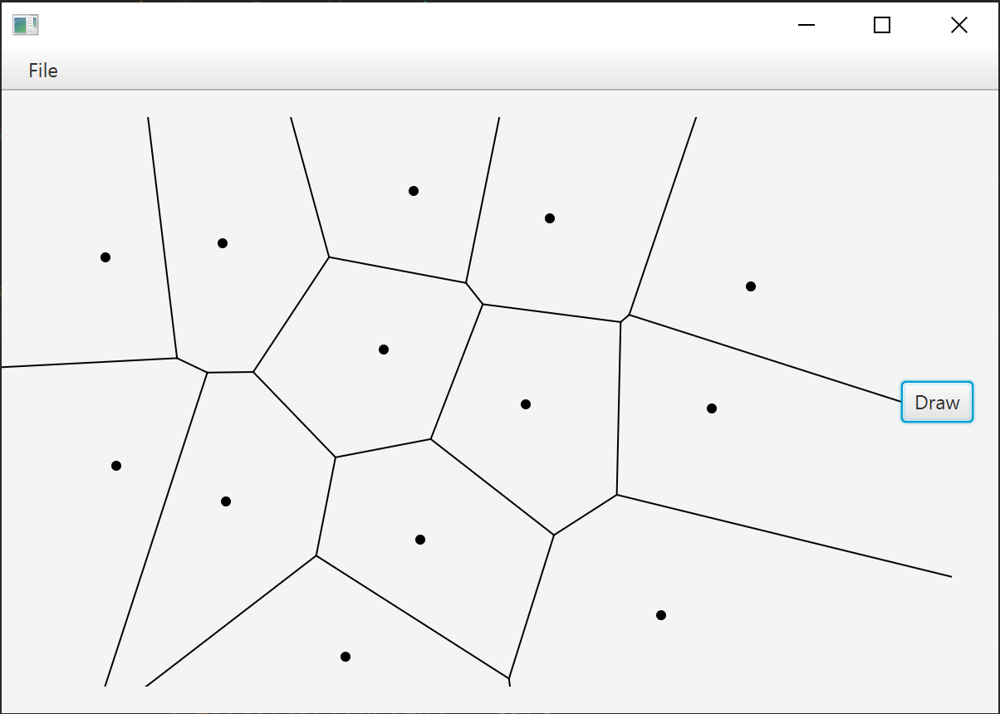

# Лабораторна робота 9 : Діаграма Вороного

**Виконав студент групи ІПС-31**

**Точаненко Владислав Володимирович**

# Опис алгоритму & огляд коду

## Допоміжні класи 

`CircleEvent` - Клас для зберігання типу івенту на береговій лінії.

```kotlin
package voronoi

class CircleEvent(
    val arc: Arc,
    p: Point?,
    val vert: Point
) : Event(p)
```

`Arc`, `ArcKey`, `ArcQuery` - класи для роботи з дугами (параболами).

```kotlin
package voronoi

class Arc : ArcKey {
    private val v: Voronoi
    var leftBreakPoint: BreakPoint?
    var rightBreakPoint: BreakPoint?

    override val left: Point?
        get() = if (leftBreakPoint != null) leftBreakPoint!!.point else Point(
            Double.NEGATIVE_INFINITY,
            Double.POSITIVE_INFINITY
        )
    override val right: Point?
        get() = if (rightBreakPoint != null) rightBreakPoint!!.point else Point(
            Double.POSITIVE_INFINITY,
            Double.POSITIVE_INFINITY
        )

    var site: Point

    constructor(left: BreakPoint?, right: BreakPoint?, v: Voronoi) {
        this.v = v
        if (left == null && right == null) {
            throw RuntimeException("cannot make arc with null breakpoints")
        }
        this.leftBreakPoint = left
        this.rightBreakPoint = right
        site = left?.s2 ?: right!!.s1
    }

    constructor(site: Point, v: Voronoi) {
        this.v = v
        leftBreakPoint = null
        rightBreakPoint = null
        this.site = site
    }

    override fun toString(): String {
        val l: Point? = left
        val r: Point? = right
        return java.lang.String.format("{%.4f, %.4f}", l?.x, r?.x)
    }

    fun checkCircle(): Point? {
        if (leftBreakPoint == null || rightBreakPoint == null) return null
        return if (Point.ccw(leftBreakPoint!!.s1, site, rightBreakPoint!!.s2) != -1)
            null
        else
            leftBreakPoint!!.edge.intersection(rightBreakPoint!!.edge)
    }
}

abstract class ArcKey : Comparable<ArcKey?> {
    abstract val left: Point?
    abstract val right: Point?

    override operator fun compareTo(other: ArcKey?): Int {
        val myLeft: Point? = left
        val myRight: Point? = right
        val yourLeft: Point? = other?.left
        val yourRight: Point? = other?.right

        if (yourLeft != null && yourRight != null && myLeft != null && myRight != null) {
            if ((other.javaClass == ArcQuery::class.java || this.javaClass == ArcQuery::class.java)
                && (myLeft.x <= yourLeft.x && myRight.x >= yourRight.x
                        || yourLeft.x <= myLeft.x && yourRight.x >= myRight.x)
            ) {
                return 0
            }
        }

        if (myLeft != null && myRight != null) {
            if (myLeft.x == yourLeft?.x && myRight.x == yourRight?.x) return 0
        }

        if (yourRight != null && myLeft != null) {
            if (myLeft.x >= yourRight.x) return 1
        }

        if (yourLeft != null && myRight != null && myLeft != null) {
            return if (myRight.x <= yourLeft.x) -1 else Point.midpoint(myLeft, myRight)
                .compareTo(yourRight?.let { Point.midpoint(yourLeft, it) })
        }
        return 0
    }
}

class ArcQuery(private val p: Point?) : ArcKey() {
    override val left: Point?
        get() = p

    override val right: Point?
        get() = p
}
```

`Point` - клас для зберігання точки.

```kotlin
package voronoi

import kotlin.math.abs
import kotlin.math.max
import kotlin.math.sqrt

class Point(val x: Double, val y: Double) : Comparable<Point?> {
    override operator fun compareTo(other: Point?): Int {
        if (other != null) {
            if (x == other.x || java.lang.Double.isNaN(x) && java.lang.Double.isNaN(other.x)) {
                if (y == other.y)
                    return 0
                return if (y < other.y) -1 else 1
            }
        }

        if (other != null) {
            return if (x < other.x) -1 else 1
        }

        return 0
    }

    override fun toString(): String {
        return String.format("(%.3f, %.3f)", x, y)
    }

    fun distanceTo(that: Point): Double {
        return sqrt((x - that.x) * (x - that.x) + (y - that.y) * (y - that.y))
    }

    override fun equals(other: Any?): Boolean {
        return other is Point && equals(
            other.x,
            x
        ) && equals(other.y, y)
    }

    companion object {
        fun minYOrderedCompareTo(p1: Point, p2: Point): Int {
            if (p1.y < p2.y) return 1
            if (p1.y > p2.y) return -1
            if (p1.x == p2.x) return 0
            return if (p1.x < p2.x) -1 else 1
        }

        fun midpoint(p1: Point, p2: Point): Point {
            val x = (p1.x + p2.x) / 2
            val y = (p1.y + p2.y) / 2
            return Point(x, y)
        }

        fun ccw(a: Point, b: Point, c: Point): Int {
            val area2 = (b.x - a.x) * (c.y - a.y) - (b.y - a.y) * (c.x - a.x)
            return if (area2 < 0) -1 else if (area2 > 0) +1 else 0
        }

        private const val EPSILON = 0.0000001
        private fun equals(a: Double, b: Double): Boolean {
            return if (a == b) true else abs(a - b) < EPSILON * max(abs(a), abs(b))
        }
    }

}
```

`BreakPoint` - клас для обробки брейкпоінтів на береговій лінії.

```kotlin
package voronoi

import kotlin.math.sqrt

class BreakPoint(
    left: Point,
    right: Point,
    private val e: VoronoiEdge,
    private val isEdgeLeft: Boolean,
    private val v: Voronoi
) {
    val s1: Point = left
    val s2: Point = right
    val edgeBegin: Point?
    private var cacheSweepLoc = 0.0
    private var cachePoint: Point? = null
    fun finish(vert: Point?) {
        if (isEdgeLeft) {
            e.p1 = vert
        } else {
            e.p2 = vert
        }
    }

    fun finish() {
        val p: Point? = point
        if (isEdgeLeft) {
            e.p1 = p
        } else {
            e.p2 = p
        }
    }

    val point: Point?
        get() {
            val l: Double = v.sweepLoc
            if (l == cacheSweepLoc) {
                return cachePoint
            }
            cacheSweepLoc = l
            val x: Double
            val y: Double

            if (s1.y == s2.y) {
                x = (s1.x + s2.x) / 2
                y = (sq(x - s1.x) + sq(s1.y) - sq(l)) / (2 * (s1.y - l))
            } else {
                val px: Double = if (s1.y > s2.y) s1.x else s2.x
                val py: Double = if (s1.y > s2.y) s1.y else s2.y
                val m: Double = e.m
                val b: Double = e.b
                val d = 2 * (py - l)

                val A = 1.0
                val B = -2 * px - d * m
                val C =
                    sq(px) + sq(py) - sq(l) - d * b
                val sign = if (s1.y > s2.y) -1 else 1
                val det = sq(B) - 4 * A * C

                x = if (det <= 0) {
                    -B / (2 * A)
                } else {
                    (-B + sign * sqrt(det)) / (2 * A)
                }
                y = m * x + b
            }
            cachePoint = Point(x, y)
            return cachePoint
        }

    override fun toString(): String {
        return java.lang.String.format("%s \ts1: %s\ts2: %s", point, s1, s2)
    }

    val edge: VoronoiEdge
        get() = e

    companion object {
        private fun sq(d: Double): Double {
            return d * d
        }
    }

    init {
        edgeBegin = point
    }
}
```

## Основний алгоритм

### Короткий опис

Необхідно побудувати діаграму Вороного, для множини точок. Діаграма Вороного – розбиття площини, при якому кожна область розбиття утворює множину точок, більш близьких до кожного елементу заданої множини точок, ніж до будь-якого іншого елементу цієї ж множини.

Використаємо алгоритм Форчуна.

### Словесний опис алгоритму

В основі алгоритму метод плоского замітання. Нехай пряма замітає площину згори до низу. В пройденій частині маємо діаграму Вороного для точок над прямою. Оскільки точки перед прямою також можуть породжувати вершини діаграми будуємо в заметеній частині берегову лінію. Берегова лінія – множина точок рівновіддалених від замітаючої прямої та точки. ГМТ цих точок – парабола. Таким чином берегова лінія – послідовність параболічних дуг, монотонна по осі абсцис.

Будемо відслідковувати зміни в береговій лінії: моменти появи та зникнення дуг.

Берегова лінія зберігається у вигляді збалансованого дерева пошуку.

### Програмна реалізація

#### Допоміжні методи

Подія точки(замітаюча пряма зустріла нову точку, до берегової лінії додається дуга).

```kotlin
private fun handleSiteEvent(cur: Event) {
    // Deal with first point case
    if (arcs.size == 0) {
        arcs[Arc(cur.p!!, this)] = null
        return
    }

    // Find the arc above the site
    val arcEntryAbove = arcs.floorEntry(ArcQuery(cur.p))
    val arcAbove = arcEntryAbove.key as Arc

    // Deal with the degenerate case where the first two points are at the same y value
    if (arcs.size == 0 && arcAbove.site.y == cur.p!!.y) {
        val newEdge = VoronoiEdge(arcAbove.site, cur.p)
        newEdge.p1 = Point((cur.p.x + arcAbove.site.x) / 2, Double.POSITIVE_INFINITY)
        val newBreak = BreakPoint(arcAbove.site, cur.p, newEdge, false, this)
        breakPoints.add(newBreak)
        edgeList.add(newEdge)
        val arcLeft = Arc(null, newBreak, this)
        val arcRight = Arc(newBreak, null, this)
        arcs.remove(arcAbove)
        arcs[arcLeft] = null
        arcs[arcRight] = null
        return
    }

    // Remove the circle event associated with this arc if there is one
    val falseCE = arcEntryAbove?.value
    if (falseCE != null) {
        events.remove(falseCE)
    }
    val breakL = arcAbove.leftBreakPoint
    val breakR = arcAbove.rightBreakPoint
    val newEdge = VoronoiEdge(arcAbove.site, cur.p!!)
    edgeList.add(newEdge)
    val newBreakL =
        BreakPoint(arcAbove.site, cur.p, newEdge, true, this)

    val newBreakR =
        BreakPoint(cur.p, arcAbove.site, newEdge, false, this)

    breakPoints.add(newBreakL)
    breakPoints.add(newBreakR)
    val arcLeft = Arc(breakL, newBreakL, this)
    val center = Arc(newBreakL, newBreakR, this)
    val arcRight = Arc(newBreakR, breakR, this)
    arcs.remove(arcAbove)
    arcs[arcLeft] = null
    arcs[center] = null
    arcs[arcRight] = null
    checkForCircleEvent(arcLeft)
    checkForCircleEvent(arcRight)
}
```

Подія кола(з берегової лінії видаляється дуга при збігу брейпоінтів, додається нова вершина діаграми Вороного).

```kotlin
private fun handleCircleEvent(ce: CircleEvent) {
    arcs.remove(ce.arc)
    ce.arc.leftBreakPoint!!.finish(ce.vert)
    ce.arc.rightBreakPoint!!.finish(ce.vert)
    breakPoints.remove(ce.arc.leftBreakPoint)
    breakPoints.remove(ce.arc.rightBreakPoint)

    var entryRight = arcs.higherEntry(ce.arc)
    var entryLeft = arcs.lowerEntry(ce.arc)
    var arcRight = Arc(Point(0.0, 0.0), this)
    var arcLeft = Arc(Point(0.0, 0.0), this)
    val ceArcLeft = ce.arc.left
    val cocircularJunction = ce.arc.right == ceArcLeft

    if (entryRight != null) {
        arcRight = entryRight.key as Arc
        while (cocircularJunction && arcRight.right == ceArcLeft) {
            arcs.remove(arcRight)
            arcRight.leftBreakPoint!!.finish(ce.vert)
            arcRight.rightBreakPoint!!.finish(ce.vert)
            breakPoints.remove(arcRight.leftBreakPoint)
            breakPoints.remove(arcRight.rightBreakPoint)
            val falseCe = entryRight!!.value
            if (falseCe != null) {
                events.remove(falseCe)
            }
            entryRight = arcs.higherEntry(arcRight)
            arcRight = entryRight.key as Arc
        }
        val falseCe = entryRight!!.value
        if (falseCe != null) {
            events.remove(falseCe)
            arcs[arcRight] = null
        }
    }
    if (entryLeft != null) {
        arcLeft = entryLeft.key as Arc
        while (cocircularJunction && arcLeft.left?.equals(ceArcLeft)!!) {
            arcs.remove(arcLeft)
            arcLeft.leftBreakPoint!!.finish(ce.vert)
            arcLeft.rightBreakPoint!!.finish(ce.vert)
            breakPoints.remove(arcLeft.leftBreakPoint)
            breakPoints.remove(arcLeft.rightBreakPoint)
            val falseCe = entryLeft!!.value
            if (falseCe != null) {
                events.remove(falseCe)
            }
            entryLeft = arcs.lowerEntry(arcLeft)
            arcLeft = entryLeft.key as Arc
        }
        val falseCe = entryLeft!!.value
        if (falseCe != null) {
            events.remove(falseCe)
            arcs[arcLeft] = null
        }
    }
    val e = VoronoiEdge(arcLeft.rightBreakPoint!!.s1, arcRight.leftBreakPoint!!.s2)
    edgeList.add(e)

    val turnsLeft = ce.p?.let {
        Point.ccw(
            arcLeft.rightBreakPoint!!.edgeBegin!!,
            it, arcRight.leftBreakPoint!!.edgeBegin!!
        )
    } == 1

    val isLeftPoint: Boolean = if (turnsLeft) e.m < 0 else e.m > 0
    if (isLeftPoint) {
        e.p1 = ce.vert
    } else {
        e.p2 = ce.vert
    }
    val newBP = BreakPoint(arcLeft.rightBreakPoint!!.s1, arcRight.leftBreakPoint!!.s2, e, !isLeftPoint, this)
    breakPoints.add(newBP)
    arcRight.leftBreakPoint = newBP
    arcLeft.rightBreakPoint = newBP
    checkForCircleEvent(arcLeft)
    checkForCircleEvent(arcRight)
}
```

#### Основний алгоритм

Програма будує точки динамічно за допомогою технології JavaFX. Раджу запустити і подивитись як воно працює.

### Приклад виконання



## Повний код

### `Main.kt`

```kotlin
import javafx.application.Application
import javafx.fxml.FXMLLoader
import javafx.scene.Parent
import javafx.scene.Scene
import javafx.stage.Stage

class Main : Application() {
    @Throws(Exception::class)
    override fun start(primaryStage: Stage?) {
        val loader = FXMLLoader()
        loader.location = javaClass.getResource("frame.fxml")
        val parent: Parent = loader.load()
        loader.setController(AppController())
        primaryStage!!.scene = Scene(parent)
        primaryStage.show()
    }

    companion object {
        @JvmStatic
        fun main(args: Array<String>) {
            launch(Main::class.java)
        }
    }
}
```

### `AppController.kt`

```kotlin
import javafx.fxml.FXML
import javafx.fxml.Initializable
import javafx.scene.canvas.Canvas
import javafx.scene.canvas.GraphicsContext
import javafx.scene.control.Button
import javafx.scene.control.MenuItem
import javafx.scene.input.MouseEvent
import javafx.scene.paint.Color
import javafx.scene.text.Font
import voronoi.Point
import voronoi.Voronoi
import java.io.*
import java.net.URL
import java.util.*
import kotlin.collections.ArrayList

class AppController : Initializable {
    @FXML
    var canvas: Canvas? = null

    @FXML
    var saveAction: MenuItem? = null

    @FXML
    var loadAction: MenuItem? = null

    @FXML
    var nextButton: Button? = null
    private var context: GraphicsContext? = null
    private val diameter = 6.0
    private val points: ArrayList<Point> = ArrayList()
    private var rectangleInput = false

    override fun initialize(location: URL?, resources: ResourceBundle?) {
        context = canvas!!.graphicsContext2D
        context?.font = Font(null, 10.0)
        onReset()
    }

    @FXML
    fun onReset() {
        println("Action")
        context!!.fill = Color.BLACK
        rectangleInput = false
        context!!.clearRect(0.0, 0.0, canvas!!.width, canvas!!.height)
    }

    @FXML
    fun onOpenFile() {
        println("Load")
        points.clear()
        try {
            val reader = BufferedReader(FileReader("int.txt"))
            var s: String?
            while (reader.readLine().also { s = it } != null) {
                val scan = Scanner(s!!).useLocale(Locale.US)
                val x = scan.nextDouble()
                val y = scan.nextDouble()
                points.add(Point(x, y))
            }
            reader.close()
            redraw()
        } catch (e1: FileNotFoundException) {
            e1.printStackTrace()
        } catch (e1: IOException) {
            e1.printStackTrace()
        }
    }

    @FXML
    fun onSaveAction() {
        println("Save")
        try {
            val writer = FileWriter("int.txt")
            val fileWriter = BufferedWriter(writer)
            for (point in points) {
                fileWriter.write(point.x.toString())
                fileWriter.write(" ")
                fileWriter.write(point.y.toString())
                fileWriter.newLine()
            }
            fileWriter.close()
        } catch (e1: IOException) {
            e1.printStackTrace()
        }
    }

    @FXML
    fun canvasClick(event: MouseEvent) {
        val x = event.x
        val y = event.y
        println("Click: $x $y")
        val point = Point(x, y)
        points.add(point)
        drawPoint(point)
    }

    private fun redraw() {
        context!!.clearRect(0.0, 0.0, canvas!!.width, canvas!!.height)
        context!!.stroke = Color.BLACK
        for (p in points) {
            drawPoint(p)
        }
    }

    @FXML
    fun nextButtonClick() {
        redraw()
        val voronoi = Voronoi(points)
        for (e in voronoi.getEdgeList()) {
            if (e!!.p1 != null && e.p2 != null) {
                val topY = if (e.p1!!.y == Double.POSITIVE_INFINITY)
                    -600.0
                else
                    e.p1!!.y
                context!!.strokeLine(e.p1!!.x, topY, e.p2!!.x, e.p2!!.y)
            }
        }
        context!!.stroke = Color.BLACK
    }

    private fun drawPoint(point: Point) {
        val x: Double = point.x
        val y: Double = point.y
        context!!.fillOval(x - diameter / 2, y - diameter / 2, diameter, diameter)
    }

}
```

### `Voronoi.kt`

```kotlin
package voronoi

import java.util.*


class Voronoi constructor(sites: ArrayList<Point>) {
    var sweepLoc: Double
    private val edgeList: ArrayList<VoronoiEdge?> = ArrayList<VoronoiEdge?>(sites.size)
    fun getEdgeList(): ArrayList<VoronoiEdge?> {
        return edgeList
    }

    private val breakPoints: HashSet<BreakPoint?> = HashSet()
    private val arcs: TreeMap<ArcKey, CircleEvent?> = TreeMap()
    private val events: TreeSet<Event> = TreeSet()

    private fun handleSiteEvent(cur: Event) {
        // Deal with first point case
        if (arcs.size == 0) {
            arcs[Arc(cur.p!!, this)] = null
            return
        }

        // Find the arc above the site
        val arcEntryAbove = arcs.floorEntry(ArcQuery(cur.p))
        val arcAbove = arcEntryAbove.key as Arc

        // Deal with the degenerate case where the first two points are at the same y value
        if (arcs.size == 0 && arcAbove.site.y == cur.p!!.y) {
            val newEdge = VoronoiEdge(arcAbove.site, cur.p)
            newEdge.p1 = Point((cur.p.x + arcAbove.site.x) / 2, Double.POSITIVE_INFINITY)
            val newBreak = BreakPoint(arcAbove.site, cur.p, newEdge, false, this)
            breakPoints.add(newBreak)
            edgeList.add(newEdge)
            val arcLeft = Arc(null, newBreak, this)
            val arcRight = Arc(newBreak, null, this)
            arcs.remove(arcAbove)
            arcs[arcLeft] = null
            arcs[arcRight] = null
            return
        }

        // Remove the circle event associated with this arc if there is one
        val falseCE = arcEntryAbove?.value
        if (falseCE != null) {
            events.remove(falseCE)
        }
        val breakL = arcAbove.leftBreakPoint
        val breakR = arcAbove.rightBreakPoint
        val newEdge = VoronoiEdge(arcAbove.site, cur.p!!)
        edgeList.add(newEdge)
        val newBreakL =
            BreakPoint(arcAbove.site, cur.p, newEdge, true, this)

        val newBreakR =
            BreakPoint(cur.p, arcAbove.site, newEdge, false, this)

        breakPoints.add(newBreakL)
        breakPoints.add(newBreakR)
        val arcLeft = Arc(breakL, newBreakL, this)
        val center = Arc(newBreakL, newBreakR, this)
        val arcRight = Arc(newBreakR, breakR, this)
        arcs.remove(arcAbove)
        arcs[arcLeft] = null
        arcs[center] = null
        arcs[arcRight] = null
        checkForCircleEvent(arcLeft)
        checkForCircleEvent(arcRight)
    }

    private fun handleCircleEvent(ce: CircleEvent) {
        arcs.remove(ce.arc)
        ce.arc.leftBreakPoint!!.finish(ce.vert)
        ce.arc.rightBreakPoint!!.finish(ce.vert)
        breakPoints.remove(ce.arc.leftBreakPoint)
        breakPoints.remove(ce.arc.rightBreakPoint)
        var entryRight = arcs.higherEntry(ce.arc)
        var entryLeft = arcs.lowerEntry(ce.arc)
        var arcRight = Arc(Point(0.0, 0.0), this)
        var arcLeft = Arc(Point(0.0, 0.0), this)
        val ceArcLeft = ce.arc.left
        val cocircularJunction = ce.arc.right == ceArcLeft
        if (entryRight != null) {
            arcRight = entryRight.key as Arc
            while (cocircularJunction && arcRight.right == ceArcLeft) {
                arcs.remove(arcRight)
                arcRight.leftBreakPoint!!.finish(ce.vert)
                arcRight.rightBreakPoint!!.finish(ce.vert)
                breakPoints.remove(arcRight.leftBreakPoint)
                breakPoints.remove(arcRight.rightBreakPoint)
                val falseCe = entryRight!!.value
                if (falseCe != null) {
                    events.remove(falseCe)
                }
                entryRight = arcs.higherEntry(arcRight)
                arcRight = entryRight.key as Arc
            }
            val falseCe = entryRight!!.value
            if (falseCe != null) {
                events.remove(falseCe)
                arcs[arcRight] = null
            }
        }
        if (entryLeft != null) {
            arcLeft = entryLeft.key as Arc
            while (cocircularJunction && arcLeft.left?.equals(ceArcLeft)!!) {
                arcs.remove(arcLeft)
                arcLeft.leftBreakPoint!!.finish(ce.vert)
                arcLeft.rightBreakPoint!!.finish(ce.vert)
                breakPoints.remove(arcLeft.leftBreakPoint)
                breakPoints.remove(arcLeft.rightBreakPoint)
                val falseCe = entryLeft!!.value
                if (falseCe != null) {
                    events.remove(falseCe)
                }
                entryLeft = arcs.lowerEntry(arcLeft)
                arcLeft = entryLeft.key as Arc
            }
            val falseCe = entryLeft!!.value
            if (falseCe != null) {
                events.remove(falseCe)
                arcs[arcLeft] = null
            }
        }
        val e = VoronoiEdge(arcLeft.rightBreakPoint!!.s1, arcRight.leftBreakPoint!!.s2)
        edgeList.add(e)

        val turnsLeft = ce.p?.let {
            Point.ccw(
                arcLeft.rightBreakPoint!!.edgeBegin!!,
                it, arcRight.leftBreakPoint!!.edgeBegin!!
            )
        } == 1

        val isLeftPoint: Boolean = if (turnsLeft) e.m < 0 else e.m > 0
        if (isLeftPoint) {
            e.p1 = ce.vert
        } else {
            e.p2 = ce.vert
        }
        val newBP = BreakPoint(arcLeft.rightBreakPoint!!.s1, arcRight.leftBreakPoint!!.s2, e, !isLeftPoint, this)
        breakPoints.add(newBP)
        arcRight.leftBreakPoint = newBP
        arcLeft.rightBreakPoint = newBP
        checkForCircleEvent(arcLeft)
        checkForCircleEvent(arcRight)
    }

    private fun checkForCircleEvent(a: Arc?) {
        val circleCenter = a!!.checkCircle()
        if (circleCenter != null) {
            val radius = a.site.distanceTo(circleCenter)
            val circleEventPoint = Point(circleCenter.x, circleCenter.y - radius)
            val ce = CircleEvent(a, circleEventPoint, circleCenter)
            arcs[a] = ce
            events.add(ce)
        }
    }

    companion object {
        private const val MAX_DIM = 600.0
        private const val MIN_DIM = -600.0
    }

    init {
        for (site in sites) {
            if (site.x > MAX_DIM || site.x < MIN_DIM || site.y > MAX_DIM || site.y < MIN_DIM) throw RuntimeException(
                String.format(
                    "Invalid site in input, sites must be between %f and %f",
                    MIN_DIM,
                    MAX_DIM
                )
            )
            events.add(Event(site))
        }
        sweepLoc = MAX_DIM
        do {
            val cur = events.pollFirst()
            sweepLoc = cur.p!!.y
            if (cur.javaClass == Event::class.java) {
                handleSiteEvent(cur)
            } else {
                val ce = cur as CircleEvent
                handleCircleEvent(ce)
            }
        } while (events.size > 0)
        sweepLoc = MIN_DIM
        for (bp in breakPoints) {
            bp!!.finish()
        }
    }
}
```

### `VoronoiEdge.kt`

```kotlin
package voronoi

class VoronoiEdge(
    private val site1: Point,
    private val site2: Point
) {
    var m = 0.0
    var b = 0.0
    private val isVertical: Boolean = site1.y == site2.y
    var p1: Point? = null
    var p2: Point? = null
    fun intersection(that: VoronoiEdge): Point? {
        if (m == that.m && b != that.b && isVertical == that.isVertical)
            return null
        val x: Double
        val y: Double
        when {
            isVertical -> {
                x = (site1.x + site2.x) / 2
                y = that.m * x + that.b
            }
            that.isVertical -> {
                x = (that.site1.x + that.site2.x) / 2
                y = m * x + b
            }
            else -> {
                x = (that.b - b) / (m - that.m)
                y = m * x + b
            }
        }
        return Point(x, y)
    }

    init {
        if (isVertical) {
            b = 0.0
            m = b
        } else {
            m = -1.0 / ((site1.y - site2.y) / (site1.x - site2.x))
            val midpoint = Point.midpoint(site1, site2)
            b = midpoint.y - m * midpoint.x
        }
    }
}
```

### `Arc.kt`

```kotlin
package voronoi

class Arc : ArcKey {
    private val v: Voronoi
    var leftBreakPoint: BreakPoint?
    var rightBreakPoint: BreakPoint?

    override val left: Point?
        get() = if (leftBreakPoint != null) leftBreakPoint!!.point else Point(
            Double.NEGATIVE_INFINITY,
            Double.POSITIVE_INFINITY
        )
    override val right: Point?
        get() = if (rightBreakPoint != null) rightBreakPoint!!.point else Point(
            Double.POSITIVE_INFINITY,
            Double.POSITIVE_INFINITY
        )

    var site: Point

    constructor(left: BreakPoint?, right: BreakPoint?, v: Voronoi) {
        this.v = v
        if (left == null && right == null) {
            throw RuntimeException("cannot make arc with null breakpoints")
        }
        this.leftBreakPoint = left
        this.rightBreakPoint = right
        site = left?.s2 ?: right!!.s1
    }

    constructor(site: Point, v: Voronoi) {
        this.v = v
        leftBreakPoint = null
        rightBreakPoint = null
        this.site = site
    }

    override fun toString(): String {
        val l: Point? = left
        val r: Point? = right
        return java.lang.String.format("{%.4f, %.4f}", l?.x, r?.x)
    }

    fun checkCircle(): Point? {
        if (leftBreakPoint == null || rightBreakPoint == null) return null
        return if (Point.ccw(leftBreakPoint!!.s1, site, rightBreakPoint!!.s2) != -1)
            null
        else
            leftBreakPoint!!.edge.intersection(rightBreakPoint!!.edge)
    }
}
```

### `ArcKey.kt`

```kotlin
package voronoi

abstract class ArcKey : Comparable<ArcKey?> {
    abstract val left: Point?
    abstract val right: Point?

    override operator fun compareTo(other: ArcKey?): Int {
        val myLeft: Point? = left
        val myRight: Point? = right
        val yourLeft: Point? = other?.left
        val yourRight: Point? = other?.right

        if (yourLeft != null && yourRight != null && myLeft != null && myRight != null) {
            if ((other.javaClass == ArcQuery::class.java || this.javaClass == ArcQuery::class.java)
                && (myLeft.x <= yourLeft.x && myRight.x >= yourRight.x
                        || yourLeft.x <= myLeft.x && yourRight.x >= myRight.x)
            ) {
                return 0
            }
        }

        if (myLeft != null && myRight != null) {
            if (myLeft.x == yourLeft?.x && myRight.x == yourRight?.x) return 0
        }

        if (yourRight != null && myLeft != null) {
            if (myLeft.x >= yourRight.x) return 1
        }

        if (yourLeft != null && myRight != null && myLeft != null) {
            return if (myRight.x <= yourLeft.x) -1 else Point.midpoint(myLeft, myRight)
                .compareTo(yourRight?.let { Point.midpoint(yourLeft, it) })
        }
        return 0
    }
}
```

### `ArcQuery.kt`

```kotlin
package voronoi

class ArcQuery(private val p: Point?) : ArcKey() {
    override val left: Point?
        get() = p

    override val right: Point?
        get() = p
}
```

### `BreakPoint.kt`

```kotlin
package voronoi

import kotlin.math.sqrt

class BreakPoint(
    left: Point,
    right: Point,
    private val e: VoronoiEdge,
    private val isEdgeLeft: Boolean,
    private val v: Voronoi
) {
    val s1: Point = left
    val s2: Point = right
    val edgeBegin: Point?
    private var cacheSweepLoc = 0.0
    private var cachePoint: Point? = null
    fun finish(vert: Point?) {
        if (isEdgeLeft) {
            e.p1 = vert
        } else {
            e.p2 = vert
        }
    }

    fun finish() {
        val p: Point? = point
        if (isEdgeLeft) {
            e.p1 = p
        } else {
            e.p2 = p
        }
    }

    val point: Point?
        get() {
            val l: Double = v.sweepLoc
            if (l == cacheSweepLoc) {
                return cachePoint
            }
            cacheSweepLoc = l
            val x: Double
            val y: Double

            if (s1.y == s2.y) {
                x = (s1.x + s2.x) / 2
                y = (sq(x - s1.x) + sq(s1.y) - sq(l)) / (2 * (s1.y - l))
            } else {
                val px: Double = if (s1.y > s2.y) s1.x else s2.x
                val py: Double = if (s1.y > s2.y) s1.y else s2.y
                val m: Double = e.m
                val b: Double = e.b
                val d = 2 * (py - l)

                val A = 1.0
                val B = -2 * px - d * m
                val C =
                    sq(px) + sq(py) - sq(l) - d * b
                val sign = if (s1.y > s2.y) -1 else 1
                val det = sq(B) - 4 * A * C

                x = if (det <= 0) {
                    -B / (2 * A)
                } else {
                    (-B + sign * sqrt(det)) / (2 * A)
                }
                y = m * x + b
            }
            cachePoint = Point(x, y)
            return cachePoint
        }

    override fun toString(): String {
        return java.lang.String.format("%s \ts1: %s\ts2: %s", point, s1, s2)
    }

    val edge: VoronoiEdge
        get() = e

    companion object {
        private fun sq(d: Double): Double {
            return d * d
        }
    }

    init {
        edgeBegin = point
    }
}
```

### `CircleEvent.kt`

```kotlin
package voronoi

class CircleEvent(
    val arc: Arc,
    p: Point?,
    val vert: Point
) : Event(p)
```

### `Event.kt`

```kotlin
package voronoi

open class Event(val p: Point?) : Comparable<Event?> {
    override operator fun compareTo(other: Event?) =
        if (other != null && p != null && other.p != null)
            Point.minYOrderedCompareTo(p, other.p)
        else 0
}
```

### `Point.kt`

```kotlin
package voronoi

import kotlin.math.abs
import kotlin.math.max
import kotlin.math.sqrt

class Point(val x: Double, val y: Double) : Comparable<Point?> {
    override operator fun compareTo(other: Point?): Int {
        if (other != null) {
            if (x == other.x || java.lang.Double.isNaN(x) && java.lang.Double.isNaN(other.x)) {
                if (y == other.y)
                    return 0
                return if (y < other.y) -1 else 1
            }
        }

        if (other != null) {
            return if (x < other.x) -1 else 1
        }

        return 0
    }

    override fun toString(): String {
        return String.format("(%.3f, %.3f)", x, y)
    }

    fun distanceTo(that: Point): Double {
        return sqrt((x - that.x) * (x - that.x) + (y - that.y) * (y - that.y))
    }

    override fun equals(other: Any?): Boolean {
        return other is Point && equals(
            other.x,
            x
        ) && equals(other.y, y)
    }

    companion object {
        fun minYOrderedCompareTo(p1: Point, p2: Point): Int {
            if (p1.y < p2.y) return 1
            if (p1.y > p2.y) return -1
            if (p1.x == p2.x) return 0
            return if (p1.x < p2.x) -1 else 1
        }

        fun midpoint(p1: Point, p2: Point): Point {
            val x = (p1.x + p2.x) / 2
            val y = (p1.y + p2.y) / 2
            return Point(x, y)
        }

        fun ccw(a: Point, b: Point, c: Point): Int {
            val area2 = (b.x - a.x) * (c.y - a.y) - (b.y - a.y) * (c.x - a.x)
            return if (area2 < 0) -1 else if (area2 > 0) +1 else 0
        }

        private const val EPSILON = 0.0000001
        private fun equals(a: Double, b: Double): Boolean {
            return if (a == b) true else abs(a - b) < EPSILON * max(abs(a), abs(b))
        }
    }

}
```

### `frame.fxml`

```xml
<?xml version="1.0" encoding="UTF-8"?>

<?import javafx.geometry.Insets?>
<?import javafx.scene.canvas.Canvas?>
<?import javafx.scene.control.*?>
<?import javafx.scene.layout.BorderPane?>
<BorderPane maxHeight="-Infinity" maxWidth="-Infinity" minHeight="-Infinity" minWidth="-Infinity" prefHeight="400.0"
            prefWidth="600.0" xmlns="http://javafx.com/javafx/8.0.172-ea" xmlns:fx="http://javafx.com/fxml/1"
            fx:controller="AppController">
    <top>
        <MenuBar BorderPane.alignment="CENTER">
            <Menu mnemonicParsing="false" text="File">
                <MenuItem fx:id="saveAction" mnemonicParsing="false" onAction="#onSaveAction" text="Save"/>
                <MenuItem fx:id="loadAction" mnemonicParsing="false" onAction="#onOpenFile" text="Load"/>
                <MenuItem mnemonicParsing="false" onAction="#onReset" text="Reset"/>
            </Menu>
        </MenuBar>
    </top>
    <center>
        <Canvas fx:id="canvas" height="343.0" onMouseClicked="#canvasClick" width="602.0"/>
    </center>
    <right>
        <Button fx:id="nextButton" mnemonicParsing="false" onMouseClicked="#nextButtonClick" text="Draw"
                BorderPane.alignment="CENTER">
            <BorderPane.margin>
                <Insets right="15.0"/>
            </BorderPane.margin>
        </Button>
    </right>
</BorderPane>
```